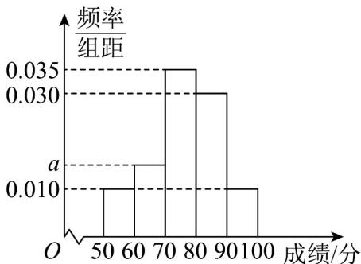
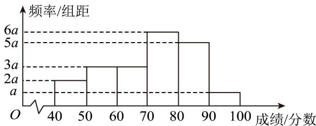

> [!faq]- 《专题03_频率分布直方图的五大常考题型_高效培优专项训练_数学人教A版》官方解析
>
> > [!success]- **【答案】**  A. $a$ 的值为0.015 B.这40名学生数学考试成绩的众数的估计值为75 C.总体中成绩落在[80,90)内的学生人数约为105 D.估计这40名学生数学考试成绩的 $P_{80}$ 约为87
>
> > [!note]- **【分析】**
> > 根据频率和等于1可求出a，从而可判断A；根据众数的概念可判断B；求出成绩落在 $[80,90)$ 内的频率，再乘以总人数可判断C；求出各组对应的频率，可知 $P_{80}$ 在 $[80,90)$ 内，列式求解即可判断D.
>
> > [!note]- **【解析】**
> > 根据频率和等于1得 $10a=1-10\times(0.01+0.035+0.03+0.01)=0.15$ 解得 a=0.015 ，故 A 正确；
> > 由频率分布直方图可知，众数的估计值为75，故 B 正确；
> > 总体中成绩落在 $[80,90)$ 内的学生人数约为 $300\times0.03\times10=90$ ，故 C 错误；
> > 各组对应的频率分别为 0.1, 0.15, 0.35, 0.3, 0.1，故 $P_{80}$ 在 $[80,90)$ 内，
> > 设 $P_{80}=x$ ，则 $0.03\times(90-x)+0.01\times10=1-80\%$ ，解得 $x\approx87$ ，故 D 正确。
> > 故选：ABD.
> >
> > 7. 为了加深师生对党史的了解，激发广大师生知史爱党、知史爱国的热情，某校举办了“学党史、育文化”暨“喜迎党的二十大”党史知识竞赛，并将1000名师生的竞赛成绩（满分100分，成绩取整数）整理成如图所示的频率分布直方图，则下列说法正确的（）
> >
> > 【答案】
> >
> > 
> > - **①**：a 的值为 0.005；
> > - **②**：估计成绩低于60分的有25人；
> > - **③**：估计这组数据的众数为 75；
> > - **④**：估计这组数据的第85百分位数为86.
> > A. ②③ B. ①③④ C. ①②④ D. ①②③
> >
> > 【答案】B
> >
> > 【分析】由所有组频率之和为 1 求得 a，再根据频率直方图中频数、众数及百分位数的求法可得结果。
> > 【详解】对于①，由 $(a+2a+3a+3a+5a+6a)\times10=1$ ，得 a=0.005。故①正确；
> > - **对于②**：，估计成绩低于60分的有 $1000\times(2a+3a)\times10=50000a=250$ 人。故②错误；
> > - **对于③**：，由众数的定义知，估计这组数据的众数为75。故③正确；
> > - **对于④**：，设这组数据的第85百分位数为m，则 $(90-m)\times5\times0.005+0.005\times10=1-85\%=0.15$ ，解得：m=86，故④正确。
> >
> > 故选 **B**
