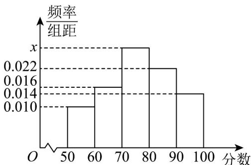

<!-- question-source:start -->
24．某校为了解高三学生身体素质情况，从某项体育测试成绩中随机抽取n个学生的成绩进行分析，得到成绩频率分布直方图（如图所示），估计该校高三学生此项体育成绩的中位数为\_\_\_\_。（结果保留整数）

<!-- question-source:end -->

![[高中/课堂同步/题库/人教A版高中数学同步讲义(2026)/02_必修第二册/第九章 统计/专项训练/专题03_频率分布直方图的五大常考题型_高效培优专项训练_数学人教A版/题型三_sec_04/questions/answers/Q00064794A1.md]]
