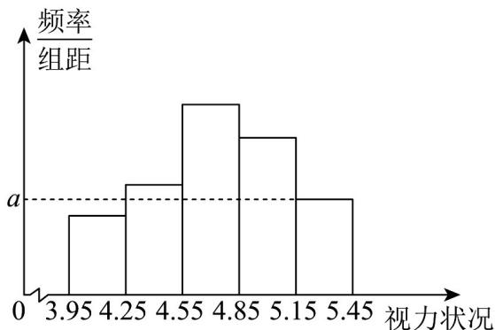

> [!faq]- 《专题03_频率分布直方图的五大常考题型_高效培优专项训练_数学人教A版》官方解析
>
> > [!success]- **【答案】** (1) $a = 0.015$ (2)105 (3)15.3125
>
> > [!note]- **【分析】**
> > （1）根据频率分布直方图中频率之和为 1 可求得 a 的值.
> >
> > (2) 首先求出该单位参加志愿服务次数不低于 15 次的频率，从而求得人数.
> >
> > (3) 根据中位数的概念即可求出该单位职工参与志愿服务次数的中位数.
>
> > [!note]- **【解析】**
> > （1）由频率分布直方图可知 $\left(0.01+0.03+0.05+0.08+2a\right)\times5=1$ ，解得a=0.015。
> > （2）由图可知该单位参加志愿服务次数不低于15次的频率为 $\left(0.08+0.015+0.01\right)\times5=0.525$ ，
> > 则该单位参加志愿服务次数不低于15次的人数为 $200\times0.525=105$ 。
> > （3）因为 $\left(0.015+0.03+0.05\right)\times5=0.475\left\langle0.5,0.475+0.08\times5=0.875\right\rangle0.5$ 所以该单位职工参与志愿服务次数的中位数的估计值在 $[15,20)$ 内。
> > 设该单位职工参与志愿服务次数的中位数的估计值为m，则 $(m-15)\times0.08+0.475=0.5$ 解得m=15.3125，即该单位职工参与志愿服务次数的中位数的估计值为15.3125.
> > 22．2025年6月6日适值第三十个全国爱眼日，本届爱眼日活动的主题确定为“守护光明，点亮未来”。当日，市疾病预防控制中心采取分层抽样方法，从立德中学2000名高二学生群体中随机抽取100名，开展视力状况专项调查。根据所得数据构建的频率分布直方图显示，自左至右的四个相邻矩形区域对应的各组频率依次为：0.125，0.175，0.3，0.25。
> >
> > 
> >
> > (1)试求图中 a 的值，并据此推算该校高二学生视力中位数的估值；
> >
> > (2)基于样本数据分析，估计该校高二学生视力不低于5.0的学生人数。
> >
> > 【答案】(1) $a = 0.5$ ，中位数为4.75；
> >
> > (2)550人.
> >
> > 【分析】（1）根据直方图求出第五组的频率，结合组距求参数值，再由中位数定义，结合直方图求中位数；
> >
> > (2) 首先确定 5.0 处于第四组的正中间，再由频率估计学生人数.
> >
> > 【详解】（1）由题意，第五组的频率 $= 1 - (0.125 + 0.175 + 0.3 + 0.25) = 0.15$ ，组距 $= 5.45 - 5.15 = 0.3$ 所以 $a = \frac{0.15}{0.3} = 0.5$
> >
> > 由题意：从左到右每组的频率依次为 0.125，0.175，0.3，0.25，0.15，
> > 所以中位数在第三组的 $\frac{2}{3}$ 处，其值为 $4.55+0.2=4.75$
> >
> > (2) 由题意，第四组的频率为 $0.25$ ，而 $5.0$ 处于第四组的正中间，所以视力不低于 $5.0$ 的频率为 $0.15 + 0.125 = 0.275$ ，根据样本估计总体，该校高二学生中视力不低于 $5.0$ 的学生有 $0.275 \times 2000 = 550$ 人。
