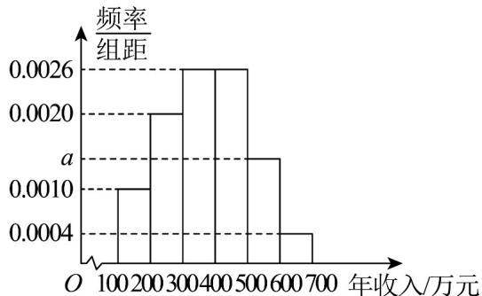

> [!faq]- 《专题03_频率分布直方图的五大常考题型_高效培优专项训练_数学人教A版》官方解析
>
> > [!success]- **【答案】**  A. 样本在区间[500,700]内的频数为 18 B. 如果规定年收入在 300 万元以内的企业才能享受减免税收政策，估计当地有 $30\%$ 的中小型企业能享受到减免税收政策 C. 样本的中位数小于 350 万元 D. 可估计当地的中小型企业年收入的平均数不超过 400 万元（同一组中的数据用该组区间的中点值为代表）
>
> > [!note]- **【分析】**
> > 由频率分布直方图的数据，先求出样本在区间[500,700]内的频率，再利用样本容量、频率、频数的关系求解，即可判断A，求出年收入在300万元以内的企业的频率，即可判断B，利用频率分布直方图中位数的求解方法，求出中位数，即可判断C，利用频率分布直方图中平均数的求解方法，求出平均数，即可判断D.
>
> > [!note]- **【解析】**
> > 由频率分布直方图可得， $100 \times (0.001 + 0.002 + 0.0026 \times 2 + a + 0.0004) = 1$ ，解得 a = 0.0014，
> > 所以样本在区间 $[500,700]$ 内的频数为 $100\times(0.0014+0.0004)\times100=18$ ，故A正确；
> >
> > 年收入在300万元以内的企业的频率为 $100 \times (0.001 + 0.002) = 0.3$ ，故B正确； $100 \times (0.001 + 0.002 + 0.0026) = 0.56 > 0.5$ ，故中位数再[300,400]之间，设中位数为 $x$ ，则有 $(x - 300) \times 0.0026 = 0.2$ ，解得 $x \approx 377 > 350$ ，故C错误；收入的平均数为 $150 \times 0.1 + 250 \times 0.2 + 350 \times 0.26 + 450 \times 0.26 + 550 \times 0.14 + 650 \times 0.04 = 376 < 400$ ，故D正确。
> >
> > 故选 **ABD**。
