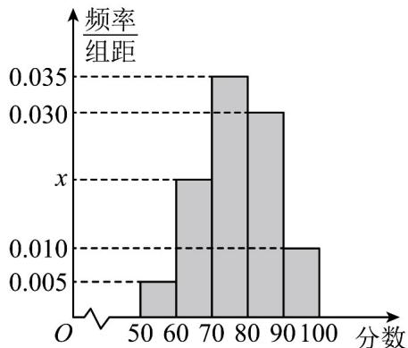
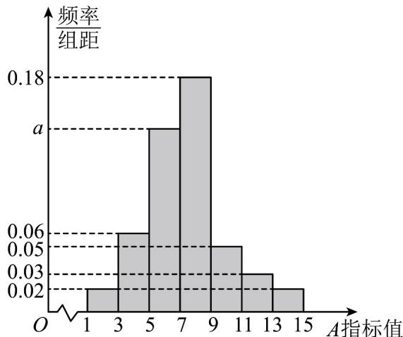

> [!faq]- 《专题03_频率分布直方图的五大常考题型_高效培优专项训练_数学人教A版》官方解析
>
> > [!success]- **【答案】** 
>
> > [!note]- **【分析】**
> > 由频率之和为1求出 $x$ 值，由中位数公式计算中位数的估计值．
>
> > [!note]- **【解析】**
> > 由频率之和为1得： $10(0.005 + x + 0.035 + 0.030 + 0.010) = 1$ ，解得 $x = 0.020$ ，$[50,70)$ 的频率为 $0.005 \times 10 + 0.02 \times 10 = 0.25 < 0.5$
> >
> > $$
> > 0. 0 0 5 \times 1 0 + 0. 0 2 \times 1 0 + 0. 0 3 5 \times 1 0 = 0. 6 > 0. 5
> > $$
> >
> > 则中位数在[70,80)内，所以这组数据中位数的估计值为 $70 + \frac{0.5 - 0.25}{0.035} \approx 77$
> >
> > 30．为调查禽类某种病菌感染情况，某养殖场每周都定期抽样检测禽类血液中 A 指标的值．养殖场将某周的 5000 只家禽血液样本中 A 指标的检测数据进行整理，绘成如图所示的频率分布直方图．根据该频率分布直方图，对于这 5000 只家食血液样本中的 A 指标值，下列的叙述正确的为（）
> >
> > 【答案】
> >
> > 
> >
> > A. 估计 $A$ 指标值的中位数为 $\frac{22}{3}$ B. 估计A指标值的 $80\%$ 分位数为9 C. 估计A指标值的众数为7.5 D. 估计A指标值的第25百分位数为 $\frac{79}{14}$
> >
> > 【答案】ABD
> >
> > 【分析】根据题意，由频率分布直方图分别计算中位数，众数以及百分位数即可得到结果.
> > 【详解】由题意可知， $(0.02+0.03+0.05+0.06+a+0.18+0.02)\times2=1$ ，解得a=0.14，
> > 因为 $2\times(0.02+0.06+0.14)=0.44<0.5$ ， $2\times(0.02+0.06+0.14+0.18)=0.8>0.5$ 所以中位数在 $(7,9]$ 之间，设中位数为x，则 $0.44+0.18(x-7)=0.5$ ，解得 $x=\frac{22}{3}$ ，故A正确；观察频率分布直方图可得， $(7,9]$ 的频率最大，所以众数为8，故C错误；
> > 由频率分布直方图可知，前两组的频率之和为 $(0.02+0.06)\times2=0.16$ ，小于0.25，
> >
> > 所以第25百分位数位于第3组，则 $5+\frac{0.25-0.16}{0.14}=\frac{79}{14}$ ，故D正确；
> >
> > 且前四组的频率之和为 $\left(0.02 + 0.06 + 0.14 + 0.18\right) \times 4 = 0.8$ ，所以 $80\%$ 分位数为9，故B正确；
> >
> > 故选 **ABD**
