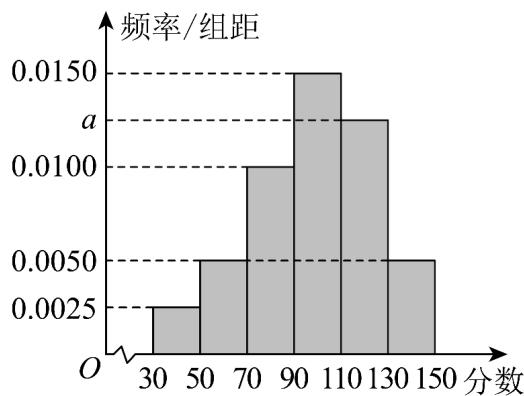

<!-- question-source:start -->
11．某校高二年级半期考试后，为了解本次考试的情况，在整个年级中随机抽取了200名学生的数学成绩，将成绩分为 $[30,50)$ ， $[50,70)$ ， $[70,90)$ ， $[90,110)$ ， $[110,130)$ ， $[130,150]$ ，共6组，得到如图所示的频率分布直方图.

(1)求实数 $a$ 的值.

(2)在样本中，采取按比例分层抽样的方法从成绩在[90,150]内的学生中抽取13名，问其中成绩在[130,150]

的学生有几名？
<!-- question-source:end -->

![[高中/课堂同步/题库/人教A版高中数学同步讲义(2026)/02_必修第二册/第九章 统计/专项训练/专题03_频率分布直方图的五大常考题型_高效培优专项训练_数学人教A版/题型二_sec_03/questions/answers/Q00064784A1.md]]
