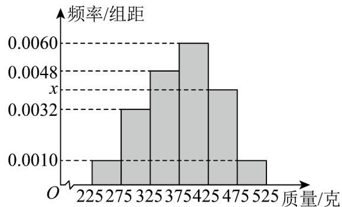

<!-- question-source:start -->
12．某山区地方政府为了帮助当地农民实现脱贫致富，大力发展当地的特色黄桃种植产业．为了了解某村黄桃的质量（单位：克）分布规律，现从该村的黄桃树上随机摘下n个黄桃组成样本进行测重，其质量均分布在区间 $^{[225,525]}$ 内，统计质量的数据作出其频率分布直方图如图所示，已知质量分布在区间 $[275,325)$ 内的黄桃有16个．

(1)求 $n$ 的值和质量分布在区间[425,475)内的黄桃个数；

(2)已知该村的黄桃树上大约有10万个黄桃待出售，某电商欲以5元/千克的价格收购该村的黄桃，请估计

该村黄桃的销售收入.
<!-- question-source:end -->

![[高中/课堂同步/题库/人教A版高中数学同步讲义(2026)/02_必修第二册/第九章 统计/专项训练/专题03_频率分布直方图的五大常考题型_高效培优专项训练_数学人教A版/题型二_sec_03/questions/answers/Q00064785A1.md]]
