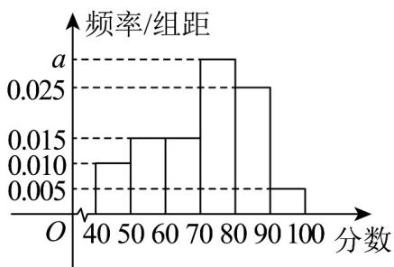

<!-- question-source:start -->
15. 在神舟十五号载人飞行任务取得了圆满成功的背景下,某学校高一年级利用高考放假期间组织 1200 名学生参加线上航天知识竞赛活动，现从中抽取 200 名学生，记录他们的首轮竞赛成绩并作出如图所示的频率分布直方图，根据图形，请回答下列问题：

(1)若从成绩不高于60分的同学中按分层抽样方法抽取10人，求10人中成绩不高于50分的人数；

(2)求 $a$ 的值，并以样本估计总体，估计该校学生首轮竞赛成绩的平均数以及中位数.
<!-- question-source:end -->

![[高中/课堂同步/题库/人教A版高中数学同步讲义(2026)/02_必修第二册/第九章 统计/专项训练/专题03_频率分布直方图的五大常考题型_高效培优专项训练_数学人教A版/题型二_sec_03/questions/answers/Q00064788A1.md]]
