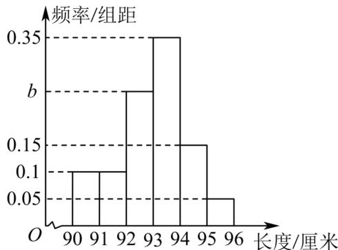

> [!faq]- 《专题03_频率分布直方图的五大常考题型_高效培优专项训练_数学人教A版》官方解析
>
> > [!success]- **【答案】**  A. $b = 0.20$ B．长度的平均数是93 C．长度的中位数一定落在区间[93,94)内 D．长度落在区间[93,94)内的个数为35
>
> > [!note]- **【分析】**
> > 按照频率分布直方图的含义，结合相关公式即可得解.
>
> > [!note]- **【解析】**
> > 对于 A，由频率和为 1，得 $\left(0.1\times2+b+0.35+0.15+0.05\right)\times1=1$ ，解得 b=0.25，故 A 错误；
> >
> > 对于 B，根据频率分布直方图长度的平均数为 $90.5\times0.1+91.5\times0.1+92.5\times0.25+93.5\times0.35+94.5\times0.15+95.5\times0.05=93$ ，故 B 正确；
> >
> > 对于 D，长度落在区间 $[93,94)$ 内的个数为 $100\times0.35=35$ ，故 D 正确；
> >
> > 对于 C， $[90,93)$ 有 $100\times(0.1+0.1+0.25)=45$ 个数， $[94,96]$ 内有 $100\times(0.15+0.05)=20$ 个数，
> >
> > 所以长度的中位数一定落在区间 $[93,94)$ 内，故 C 正确。
> >
> > 故选 **A**
