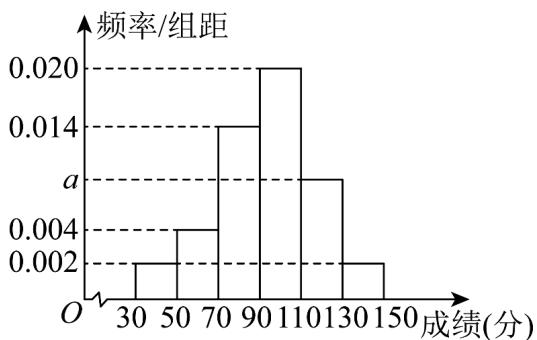
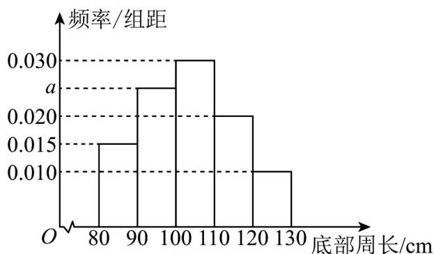
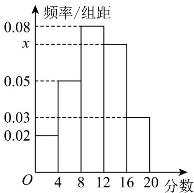

> [!faq]- 《专题03_频率分布直方图的五大常考题型_高效培优专项训练_数学人教A版》官方解析
>
> > [!success]- **【答案】**  A. $a = 0.008$ B.约有200人的成绩不低于110分 C.约有60人的成绩低于70分 D.本次考试的平均分约为93.6分
>
> > [!note]- **【分析】**
> > 借助频率分布直方图定义计算可得 A；借助频率分布直方图计算对应频数可得 B、C；借助平均数定义计算可得 D.
>
> > [!note]- **【解析】**
> > 对 A： $(0.002+0.004+0.014+0.020+a+0.002)\times20=1$ ，解得 a=0.008，故 A 正确；
> > 对 B： $(0.008+0.002)\times20\times1000=200$ ，则约有 200 人的成绩不低于 110 分，故 B 正确；
> > 对 C： $(0.002+0.004)\times20\times1000=120$ ，故约有 120 人的成绩低于 70 分，故 C 错误；
> > 对 D： $(0.002\times40+0.004\times60+0.014\times80+0.020\times100+0.008\times120+0.002\times140)\times20=93.6$ ，
> > 故本次考试的平均分约为 93.6 分，故 D 正确.
> >
> > 故选：ABD.
> >
> > 18．为了解一片经济林的生长情况，随机抽取了其中60株树木，测量底部周长（单位：cm），所得数据均在区间[80,130]内，其频率分布直方图如图所示，则（）
> >
> > 【答案】
> >
> > 
> >
> > A. 图中 $a$ 的值为 0.025
> > B. 样本中底部周长不小于 $110\mathrm{cm}$ 的树木有 12 株
> > C. 估计该片经济林中树木的底部周长的 $80\%$ 分位数为 115
> > D. 估计该片经济林中树木的底部周长的平均数为 104（每组数据用该组所在区间的中点值作代表）
> >
> > 【答案】AC
> >
> > 【分析】根据频率分布直方图的性质，以及平均数和百分位数，以及频数与频率的计算方法，逐项判定，即可求解.
> >
> > 【详解】对于 A 中，由频率分布直方图的性质，可得 $(0.015 + a + 0.030 + 0.020 + 0.010) \times 10 = 1$ ，解得 a = 0.025，所以 A 正确；
> > 对于 B 中，由频率分布直方图，可得不小于 110 cm 的频数为 $(0.020 + 0.010) \times 10 = 0.3$ ，所以不小于 110 cm 的树木有 $0.3 \times 60 = 18$ 株，所以 B 错误；
> > 对于 C 中，由频率分布直方图得，前三个矩形的面积为 $(0.015 + 0.025 + 0.030) \times 10 = 0.7$ ，前四个矩形的面积为 $(0.015 + 0.025 + 0.030 + 0.020) \times 10 = 0.9$ ，
> > 所以 $_{80\%}$ 分位数位于区间 [110,120)，则 $110 + \frac{0.010}{0.020} \times 10 = 115$ ，所以 C 正确；
> > 对于 D 中，由频率分布直方图的平均数的计算公式，可得： $(85 \times 0.015 + 95 \times 0.025 + 105 \times 0.030 + 115 \times 0.020 + 125 \times 0.010) \times 10 = 103.5$ ，所以 D 错误；
> >
> > 故选：AC.
> >
> > 19．2023年寒假期间，哈尔滨成为了新的旅游打卡城市，某校学生开展社会实践活动，采用问卷的形式随机对来哈尔滨旅游的100名游客进行了有关哈尔滨旅游知识的调查．为了方便统计分析，调查问卷满分20分，得分情况制成如图所示的频率分布直方图．
> >
> > 
> > (1)求 $x$ 的值；
> >
> > (2)根据频率分布直方图，估计这100名游客调查问卷中得分的平均数及中位数（各组区间的数据以该组区间的中间值作代表）.
> >
> > 【答案】(1)x=0.07
> >
> > (2)平均数为 10.64，中位数是 10.75
> >
> > 【分析】（1）根据频率之和为1即可求解，
> > (2) 根据中位数的计算公式即可求解.
> > 【详解】（1） $(0.02+0.05+0.08+x+0.03)\times4=1$ ，所以x=0.07。
> > (2) 设这100名游客调查问卷中得分的平均数为 $\overline{x}$ ，
> > 则 $\overline{x}=2\times0.02\times4+6\times0.05\times4+10\times0.08\times4+14\times0.07\times4+18\times0.03\times4=10.64$ 因为 $0.02 \times 4 + 0.05 \times 4 = 0.28 < 0.5$ ， $0.02 \times 4 + 0.05 \times 4 + 0.08 \times 4 = 0.6 > 0.5$ ，
> > 所以中位数在8和12之间，
> > 设中位数是t，所以 $0.02\times4+0.05\times4+(t-8)\times0.08=0.5$ ，可得t=10.75。
