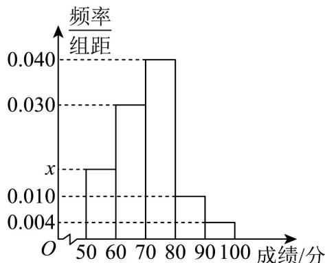

> [!faq]- 《专题03_频率分布直方图的五大常考题型_高效培优专项训练_数学人教A版》官方解析
>
> > [!success]- **【答案】**  A. 估计该市考生的成绩低于60分的比例为 $16\%$ B. 估计该市考生成绩的众数为60 C. 估计该市考生成绩的平均数为70.6 D. 估计该市82分以上的考生将获得“优秀学生”称号
>
> > [!note]- **【分析】**
> > 先利用直方图的性质，直接判断选项A，B，C；通过估算面积的方法，以样本频率估计总体概率来判断选项D.【详解】对于A，由直方图的性质知： $(x + 0.030 + 0.040 + 0.010 + 0.004)\times 10 = 1$ ，解得 $x = 0.016$ ，所以样本成绩低于60分的频率为 $0.016\times 10 = 0.16$ ；所以以样本的频率估计总体概率，故A正确；
>
> > [!note]- **【解析】**
> > 对于B，总体众数的估计值是直方图面积最大的直方块横坐标对应范围的中点值，
> > 即众数为 75，故 B 错误；
> > 对于 C，总体平均数的估计值为各直方块中点值与各块面积的乘积的和，
> > $55 \times 0.16 + 65 \times 0.3 + 75 \times 0.4 + 85 \times 0.1 + 95 \times 0.04 = 70.6$ ，故 C 正确；
> > 对于 D，样本中90分以上的占比4%，
> > 估计总体荣获“优秀学生”的分数为： $90 - \frac{6\%}{10\%} \times 10 = 84$ ，故 D 错误.
> >
> > 故选 **AC**.
