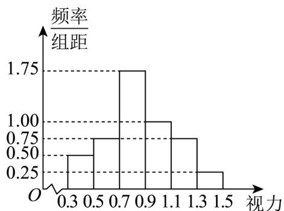

<!-- question-source:start -->
43．对学校高三年级某班50名学生的高校招生体检表中视力情况进行统计，其结果的频率分布直方图如图．若高校A专业对视力要求不低于0.9，则该班学生中有\_\_\_\_人能报考该专业．

<!-- question-source:end -->

![[高中/课堂同步/题库/人教A版高中数学同步讲义(2026)/02_必修第二册/第九章 统计/专项训练/专题03_频率分布直方图的五大常考题型_高效培优专项训练_数学人教A版/题型五_sec_06/questions/answers/Q00064801A1.md]]
