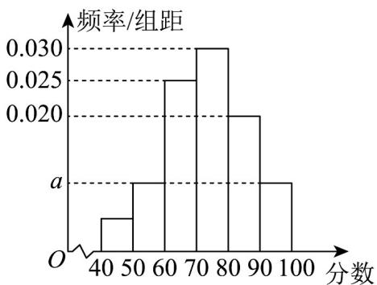

> [!faq]- 《专题03_频率分布直方图的五大常考题型_高效培优专项训练_数学人教A版》官方解析
>
> > [!success]- **【答案】** 0.01 
>
> > [!note]- **【分析】**
> > 根据题干先确定分数低于 60 分的频率，涉及的区间包括两个部分，通过观察直方图列方程组，即可求解.
>
> > [!note]- **【解析】**
> > 样本中分数低于60分的有15人，属于区间 $\left[40,50\right)$ ， $\left[50,60\right)$ ，由于学生中随机抽取了100名，因此分数在 $\left[40,50\right)$ ， $\left[50,60\right)$ 的频数为15，因此这两个区间内的频率和为 $\frac{15}{100}=0.15$ ，
> > 设区间 $\left[40,50\right)$ 的频率为 $x$ ，则 $\begin{cases}x+10a=0.15\\x+10a+0.25+0.3+0.2+10a=1\end{cases}$ ，解得a=0.01.
> > 故答案为：0.01.
