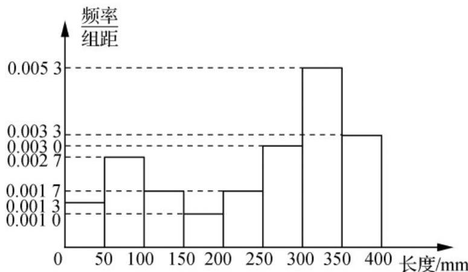

> [!faq]- 《专题03_频率分布直方图的五大常考题型_高效培优专项训练_数学人教A版》官方解析
>
> > [!success]- **【答案】** C
>
> > [!note]- **【分析】**
> > 先求得视力在0.9以上的频率，再根据频数、频率、样本容量的关系即可求得答案.
> >
> > $$
> > (1 + 0. 7 5 + 0. 2 5) \times 0. 2 = 0. 4
> > $$
> >
> > $$
> > 5 0 \times 0. 4 = 2 0
> > $$
> >
> > 故答案为：20.
> >
> > 44．棉花的纤维长度是棉花质量的重要指标．在一批棉花中抽测了60根棉花的纤维长度（单位：mm）
> >
> > 将样本数据作成如下的频率分布直方图，下列关于这批棉花质量状况的分析合理的是（）
> >
> > 
> >
> > A. 这批棉花的纤维长度不是特别均匀
> > B. 有一部分棉花的纤维长度比较短
> > C. 有超过一半的棉花纤维长度能达到 $300\mathrm{mm}$ 以上
> > D. 这批棉花有可能混进了一些次品
> >
> > 【答案】ABD
>
> > [!note]- **【解析】**
> > 从图形分析，这批棉花的纤维长度参差不齐，所以不是特别均匀，其中纤维长度在 $[0,100)$ 的频率为 $(0.0013+0.0027)\times50=0.2$ ，即有20%的棉花的纤维长度比较短，从而这批棉花中可能混进了一些次品。纤维长度超过300mm的频率为 $(0.0053+0.0033)\times50=0.43$ ，因为0.43<0.5，所以棉花纤维长度达到300mm以上的不超过一半，C不合理。
