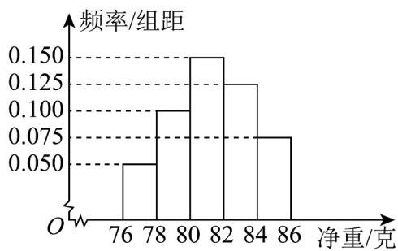
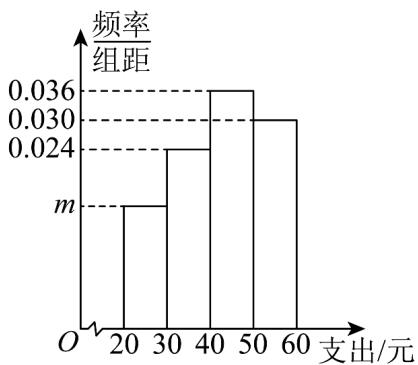
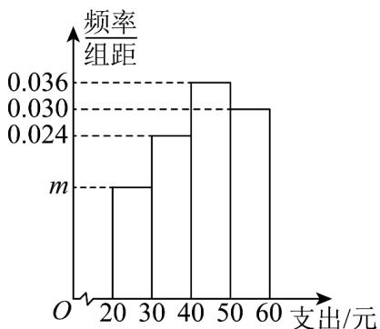
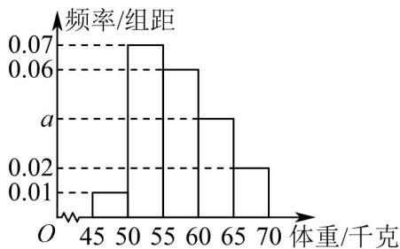

> [!faq]- 《专题03_频率分布直方图的五大常考题型_高效培优专项训练_数学人教A版》官方解析
>
> > [!success]- **【答案】** 
>
> > [!note]- **【分析】**
> > 根据频率分布直方图中的数据，求得净重大于或等于80克的频率为0.7，进而的得到答案。
>
> > [!note]- **【解析】**
> > 由频率分布直方图，可得净重大于或等于80克的频率为 $P=(0.15+0.125+0.075)\times2=0.7$ ，
> > 所以净重大于或等于80克的个数为 $200\times0.7=140$ 个.
> >
> > 故选：B.
> >
> > 47. 学校为了调查学生在课外读物方面的支出情况，抽取了一个容量为 $n$ 的样本，其频率直方图如图所示，其中支出在[20, 30)内的同学有10人，则 $n$ 的值为 \_\_\_\_.
> >
> > 【答案】
> >
> > 
> >
> > 【答案】100
> >
> > 【分析】利用频率直方图的性质计算出频率，即可求出结果.
> > 【详解】
> >
> > 
> >
> > 由频率直方图可得，支出在 $\left[20,30\right)$ 内的频率为 $1 - 10\times (0.024 + 0.036 + 0.030) = 0.1$ 所以有 $\frac{10}{n} = 0.1\Rightarrow n = 100$ 故答案为：100.
> >
> > 
