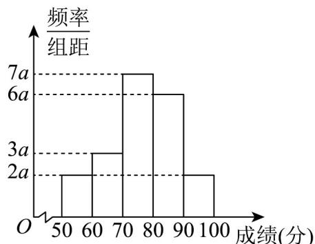

<!-- question-source:start -->
36. 某次考试后，年级组抽取了100名同学的数学考试成绩，绘制了如下图所示的频率分布直方图。

(1)根据图中数据计算参数 $a$ 的值，并估算这100名同学成绩的平均数和中位数，结果保留至百分位；

(2)已知这100名同学中，成绩位于 $[80,90)$ 内的同学成绩方差为12，成绩位于 $[90,100)$ 内的同学成绩方差为10，为了分析学优生的成绩分布情况，请估算成绩在80分及以上的同学的成绩的平均数和方差。
<!-- question-source:end -->

![[高中/课堂同步/题库/人教A版高中数学同步讲义(2026)/02_必修第二册/第九章 统计/专项训练/专题03_频率分布直方图的五大常考题型_高效培优专项训练_数学人教A版/题型四_sec_05/questions/answers/Q00064796A1.md]]
