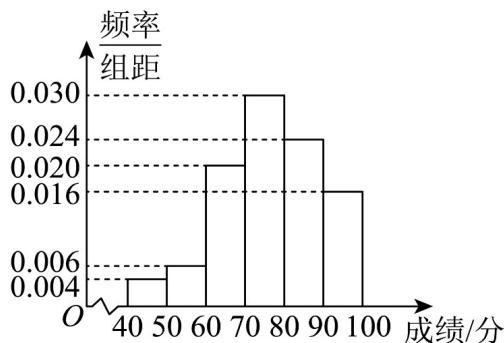

<!-- question-source:start -->
3．从高三抽出 50 名学生参加数学竞赛，由成绩得到如图的频率分布直方图，则估计这 50 名学生成绩的 75% 分位数为 \_\_\_\_ 分．

<!-- question-source:end -->

![[高中/课堂同步/题库/人教A版高中数学同步讲义(2026)/02_必修第二册/第九章 统计/专项训练/专题04_样本估计总体的五大常考题型_高效培优专项训练_数学人教A版高/题型一_sec_02/questions/answers/Q00064808A1.md]]
