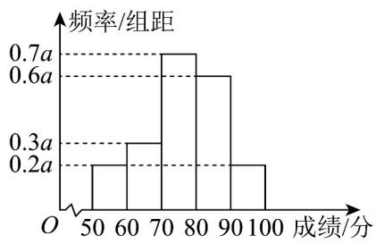
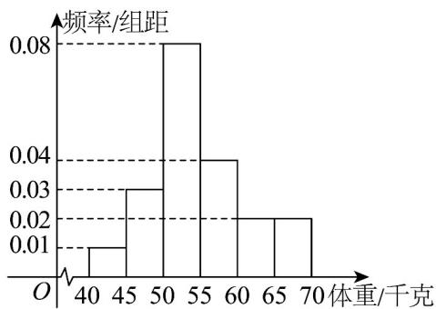

> [!faq]- 《专题04_样本估计总体的五大常考题型_高效培优专项训练_数学人教A版高》官方解析
>
> > [!success]- **【答案】** A. 118 B. 121 C. 122 D. 123
>
> > [!note]- **【分析】**
> > 根据百分位数的定义计算.
>
> > [!note]- **【解析】**
> > 已知数据按从小到大排列为：103,106,113,118,118,119,121,123,125,134， $75\% \times 10 = 7.5$ ，因此第75百分位数是第8个数123.
> >
> > 故选：D.
> >
> > 
> >
> > 9. 高二年级进行消防知识竞赛，统计所有参赛同学的成绩，成绩都在[50,100]内，估计所有参赛同学成绩的第75百分位数为（）
> >
> > 【答案】
> > 频率/组距
> > O 50 60 70 80 90 100 成绩/分
> > A. 65 B. 75 C. 85 D. 95
> >
> > 【答案】C
> >
> > 【分析】先由长方形的面积和为 1 求出 a，再由第 75 百分位数的定义求解；
> > 【详解】因为 $2a \times 10 = 1$ ，所以 a = 0.05。
> >
> > 参赛成绩位于 $[50,80)$ 内的频率为 $10 \times (0.01 + 0.015 + 0.035) = 0.6$ ，第75百分位数在 $[80,90)$ 内，设为 $80 + y$ ，则 $0.03y = 0.15$ ，
> >
> > 解得 y = 5，即第 75 百分位数为 85，
> >
> > 故选：C.
> >
> > 10．《中国居民膳食指南（2022）》数据显示，6岁至17岁儿童青少年超重肥胖率高达 $19.0\%$ .为了解某地中学生的体重情况，某机构从该地中学生中随机抽取100名学生，测量他们的体重（单位：千克），根据测量数据，按[40,45)，[45,50)，[50,55)，[55,60)，[60,65)，[65,70]分成六组，得到的频率分布直方图如图所示，根据调查的数据，估计该地中学生体重的 $50\%$ 分位数是\_\_\_\_。
> >
> > 【答案】
> >
> > 
> > 【答案】53.75
> >
> > 【分析】先根据频率分布直方图判断 $50\%$ 分位数的位置，然后列方程求解即可.
> > 【详解】因为前2组的频率和为 $5 \times (0.01 + 0.03) = 0.2 < 0.5$ ，
> > 前3组的频率和为 $5 \times (0.01 + 0.03 + 0.08) = 0.6 > 0.5$ ，
> > 所以 $50\%$ 分位数在 $[50,55)$ 内，
> > 设 $50\%$ 分位数为 $m$ ，则 $0.2 + 0.08 \times (m - 50) = 0.5$ ，解得 $m = 53.75$ ：
> > 故答案为：53.75
