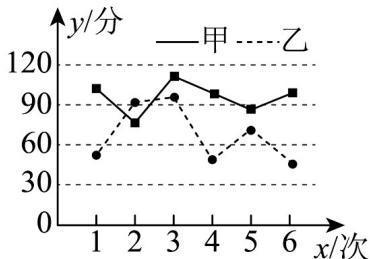

> [!faq]- 《专题04_样本估计总体的五大常考题型_高效培优专项训练_数学人教A版高》官方解析
>
> > [!success]- **【答案】** A. 平均数 B. 极差 C. 方差 D. 中位数
>
> > [!note]- **【分析】**
> > 根据平均数，极差，中位数的计算即可比较求解，利用方差的性质即可求解 C.
>
> > [!note]- **【解析】**
> > 样本数据 1, 2, 2, 2, 3, 5 的平均数为 $\frac{5}{2}$ , 极差为 4, 中位数为 2,
> >
> > 去掉1和5后的数据的平均数为 $\frac{9}{4}$ ，极差为1，中位数为2，故平均数和极差都发生变化，中位数不改变，由于去掉1和5后，数据的波动性更小，故相比较于原数据，方差变小，故ABC错误，D正确.
> >
> > 42．样本数据 20, 24, 6, 15, 18, 10, 42, 57, 2, 7 的极差为 $a$ ，中位数为 $b$ ，则 $\frac{a}{b} =$ \_\_\_\_。
> >
> > 【答案】 $\frac{10}{3}/3\frac{1}{3}$
> >
> > 【分析】将数据从小到大排列，求出数据的极差和中位数，即可求得答案.
> >
> > 【详解】由题意知样本数据从小到大排列为 2 , 6 , 7 , 10 , 15 , 18 , 20 , 24 , 42 , 57
> >
> > 故极差为 $a = 57 - 2 = 55$ ，中位数为 $b = \frac{15 + 18}{2} = \frac{33}{2}$
> >
> > 故 $\frac{a}{b} = \frac{55}{\frac{33}{2}} = \frac{10}{3}$
> >
> > 故答案为： $\frac{10}{3}$
> >
> > 43. 样本数据 5.8, 5.9, 5.9, 6.0, 6.1, 6.1, 6.3, 6.1 的极差与第 70 百分位数之差为 ( )
> >
> > 【答案】
> > A.-5.8 B.-5.6 C.5.6 D.5.8
> >
> > 【答案】B
> > 【分析】根据给定条件，利用极差、第70百分位数的定义求解.
> > 【详解】依题意，样本数据从小到大排列为 $5.8, 5.9, 5.9, 6.0, 6.1, 6.1, 6.1, 6.3$ ，极差为 $6.3 - 5.8 = 0.5$ ，由 $8 \times 0.7 = 5.6$ ，得样本数据的第70百分位数为6.1，所以所求差为 $0.5 - 6.1 = -5.6$ .故选：B
> >
> > 
