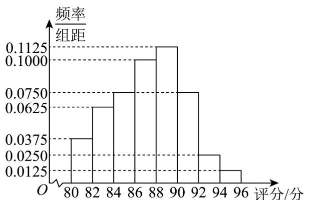

<!-- question-source:start -->
5. 某校高一（3）班的40位同学对班委会组织的主题班会进行了评分（满分100分），并绘制出如图所示

的频率分布直方图，则下列结论中正确的是（）

A．评分在区间 $[94,96]$ 内的有2人 B．评分的中位数在区间 $[86,88]$ 内 C．评分的众数是90分 D．评分的平均数大于90分
<!-- question-source:end -->

![[高中/课堂同步/题库/人教A版高中数学同步讲义(2026)/02_必修第二册/第九章 统计/专题03 频率分布直方图的五大常考题型（高效培优专项训练）数学人教A版高一必修第二册/题型一_根据频率分布直方图求众数/questions/answers/Q00077989A1.md]]
