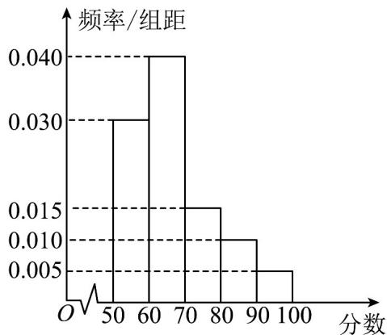

<!-- question-source:start -->
8. 某中学举行电脑知识竞赛，现将高一参赛学生的成绩进行整理后分成五组绘制成如图所示的频率分布直方图，已知图中从左到右的第一、二、三、四、五小组的频率分别是 $0.30, 0.40, 0.15, 0.10, 0.05$ . 求：高一参赛学生的成绩的众数、中位数.

<!-- question-source:end -->

![[高中/课堂同步/题库/人教A版高中数学同步讲义(2026)/02_必修第二册/第九章 统计/专题03 频率分布直方图的五大常考题型（高效培优专项训练）数学人教A版高一必修第二册/题型一_根据频率分布直方图求众数/questions/answers/Q00077991A1.md]]
