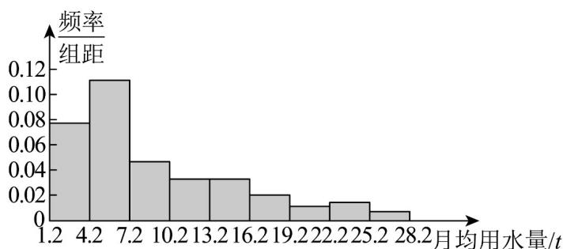

> [!faq]- 《专题03 频率分布直方图的五大常考题型（高效培优专项训练）数学人教A版高一必修第二册》官方解析
>
> > [!success]- **【答案】**  A. 平均数 $>$ 中位数 B. 中位数 $>$ 平均数 C. 中位数 $>$ 众数 D. 众数 $>$ 平均数
>
> > [!note]- **【分析】**
> > 首先计算众数，再估算中位数和平均数，或是根据频率分布直方图的特征判断平均数和中位数的大小.
>
> > [!note]- **【解析】**
> > 由图可知，众数为 $\frac{4.2+7.2}{2}=5.7$ 估计中位数为 $0.077 \times 3 + (x - 4.2) \times 0.107 = 0.5$ ，得 $x \approx 6.71$ ，
> >
> > 估计平均数 $(2.7\times 0.077 + 5.7\times 0.107 + 8.7\times 0.044 + 11.7\times 0.03 + 14.7\times 0.03$ $+17.7\times 0.017 + 20.7\times 0.01 + 23.7\times 0.013 + 26.7\times 0.007)\times 3 = 9.96$
> >
> > 并且也可以从直方图的特征判断，此直方图在右边“拖尾”，所以平均数大于中位数.
> >
> > 所以平均数>中位数，中位数>众数.
> >
> > 故选 **AC**
