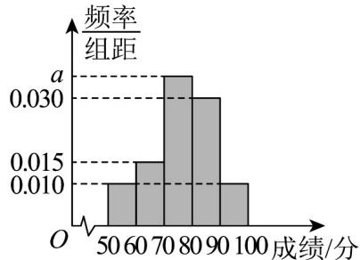

> [!faq]- 《专题03 频率分布直方图的五大常考题型（高效培优专项训练）数学人教A版高一必修第二册》官方解析
>
> > [!success]- **【答案】**  A. $a$ 的值为0.035 B.估计这100名学生成绩的众数是75 C.估计这100名学生成绩的平均数为78 D.估计这100名学生成绩的中位数为 $\frac{540}{7}$
>
> > [!note]- **【分析】**
> > 根据频率之和为 1 求 a 判断 A；根据众数定义判断 B，根据频率直方图求平均值判断 C，根据中位数的求法判断 D.
>
> > [!note]- **【解析】**
> > 由题意知 $\left(0.010 + 0.015 + a + 0.030 + 0.010\right) \times 10 = 1$ ，解得 a = 0.035，故 A 正确；
> > 估计这 100 名学生成绩的众数是 $\frac{70+80}{2}=75$ ，故 B 正确；
> > 估计这 100 名学生成绩的平均数为 $55 \times 0.1 + 65 \times 0.15 + 75 \times 0.35 + 85 \times 0.3 + 95 \times 0.1 = 76.5$ ，故 C 错误；
> > 设这 100 名学生成绩的中位数为 m，所以， $\frac{m-70}{10} \times 0.35 + 0.25 = 0.5$ ，解得 $m = \frac{540}{7}$ ，故 D 正确。
> >
> > 故选 **ABD**．
