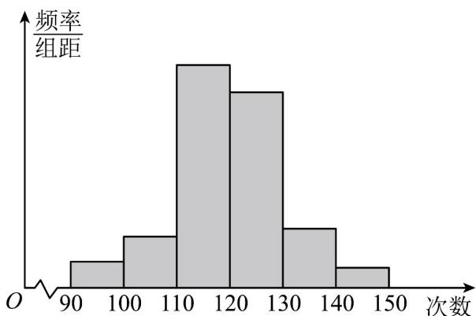
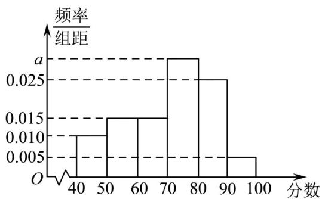

> [!faq]- 《专题03 频率分布直方图的五大常考题型（高效培优专项训练）数学人教A版高一必修第二册》官方解析
>
> > [!success]- **【答案】** 众数为65，中位数为65
>
> > [!note]- **【分析】**
> > 频率分布直方图中最高矩形所在的区间的中点值作为众数的近似值，即可得出众数，利用中位数的两边频率相等，即可求得中位数.
>
> > [!note]- **【解析】**
> > 用频率分布直方图中最高矩形所在的区间的中点值作为众数的近似值，
> >
> > 得众数为 $\frac{60 + 70}{2} = 65$
> >
> > 因为 $0.03 \times 10 = 0.3 < 0.5, (0.03 + 0.04) \times 10 = 0.7 > 0.5$
> >
> > 所以中位数在 $60 \sim 70$ 之间，设中位数为 $x$ ，
> >
> > 则 $0.3 + 0.04(x - 60) = 0.5$ ，解得 $x = 65$ ，所以中位数为65.
> >
> > 9. 为了了解高一学生的体能情况，某校抽取部分学生进行1分钟跳绳测试，将所得数据整理后，画出频率分布直方图(如图). 图中从左到右各小矩形面积之比为2:4:17:15:9:3，第二小组频数为12.
> >
> > 
> >
> > (1)第二小组的频率是多少?样本容量是多少?
> >
> > (2)通过频率分布直方图估计总体的平均数、中位数、众数.
> >
> > 【答案】(1)频率是0.08，样本容量是150
> >
> > (2)平均数为121.8，中位数为 $\frac{364}{3}$ ，众数为115
> >
> > 【分析】（1）直接根据公式计算频率和样本容量得到答案；
> >
> > (2) 根据频率分布直方图分别求众数、平均数和中位数.
> >
> > 【详解】（1）第二组的频率是 $\frac{4}{2+4+17+15+9+3}=0.08$ ，样本容量是 $\frac{12}{0.08}=150$ 。
> >
> > (2) 有频率分布直方图可知，在频率分布直方图中最高的小长方形的底边的中点就是这组数据的众数，即样本众数是 115，
> >
> > 因为各组的频率分别是：0.04，0.08，0.34，0.30，0.18，0.06，
> >
> > 所以样本平均数是：
> >
> > $$
> > \overline {{x}} = 9 5 \times 0. 0 4 + 1 0 5 \times 0. 0 8 + 1 1 5 \times 0. 3 4 + 1 2 5 \times 0. 3 0 + 1 3 5 \times 0. 1 8 + 1 4 5 \times 0. 0 6 = 1 2 1. 8
> > $$
> >
> > $$
> > \because 0. 0 4 + 0. 0 8 + 0. 3 4 = 0. 4 6 <   0. 5 0. 0 4 + 0. 0 8 + 0. 3 4 + 0. 3 0 = 0. 7 6 > 0. 5
> > $$
> >
> > ∴中位数在第四组，不妨设中位数为 x ，
> >
> > 则有 $0.04 + 0.08 + 0.34 + 0.03(x - 120) = 0.5$ ，解得 $x = \frac{364}{3}$
> >
> > 所以样本中位数为 $\frac{364}{3}$ .
> >
> > 于是可以估计样本平均数为 121.8，中位数为 $\frac{364}{3}$ ，众数为 115.
> >
> > 10．2022年起，某省将实行“3+1+2”高考模式，为让学生适应新高考的赋分模式，某校在一次校考中使用赋分制给高三年级学生的生物成绩进行赋分，具体赋分方案如下：先按照考生原始分从高到低按比例划定A、B、C、D、E共五个等级，然后在相应赋分区间内利用转换公式进行赋分A等级排名占比15%，赋分分数区间是86-100；B等级排名占比35%，赋分分数区间是71-85：C等级排名占比35%，赋分分数区间是56-70：D等级排名占比13%，赋分分数区间是41-55；E等级排名占比2%，赋分分数区间是30-40；现从全年级的生物成绩中随机抽取100名学生的原始成绩（未赋分）进行分析，其频率分布直方图如图所示：
> >
> > 
> >
> > (1)求图中 $a$ 的值；
> >
> > (2)求抽取的这100名学生的原始成绩的众数、平均数和中位数；
> >
> > (3)用样本估计总体的方法，估计该校本次生物成绩原始分不少于多少分才能达到赋分后的 $B$ 等级及以上（含 $B$ 等级）？（结果保留整数）
> >
> > 【答案】(1) $a = 0.030$
> >
> > (2)众数75分；中位数 $\frac{220}{3}$ 分，平均数71分
> >
> > (3)74 分
> >
> > 【分析】（1）由各组频率之和为1列方程求解即可；
> >
> > (2) 由频率分布直方图中众数、平均数和中位数的计算公式代入即可得出答案；
> >
> > （3）已知等级达到 B 及以上所占排名等级占比为 0.50，即为频率分布直方图的中位数，求解即可.
> > 【详解】（1）由题意 $\left(0.010+0.015+0.015+a+0.025+0.005\right)\times10=1$ ，解得a=0.030；
> >
> > $$
> > \frac {7 0 + 8 0}{2} = 7 5 \text {分}
> > $$
> >
> > $$
> > (0. 0 1 0 + 0. 0 1 5 + 0. 0 1 5) \times 1 0 = 0. 4 <   0. 5
> > $$
> >
> > $$
> > (0. 0 1 0 + 0. 0 1 5 + 0. 0 1 5 + 0. 0 3 0) \times 1 0 = 0. 7 > 0. 5
> > $$
> >
> > $$
> > (x - 7 0) \times 0. 0 3 0 = 0. 5 - 0. 4
> > $$
> >
> > 故抽取的这 100 名学生的原始成绩的中位数的估计值为 $\frac{220}{3}$ 分，
> >
> > $$
> > x = \frac {2 2 0}{3}
> > $$
> >
> > 抽取的这 100 名学生的原始成绩的平均数的估计值为：
> >
> > $$
> > \left(4 5 \times 0. 0 1 0 + 5 5 \times 0. 0 1 5 + 6 5 \times 0. 0 1 5 + 7 5 \times 0. 0 3 0 + 8 5 \times 0. 0 2 5 + 9 5 \times 0. 0 0 5\right) \times 1 0 = 7 1 _ {\text {分}}
> > $$
> >
> > (3) 由已知等级达到 B 及以上所占排名等级占比为 $0.15 + 0.35 = 0.50$
> >
> > 由（2）可得，中位数 $x = \frac{220}{3} \approx 73.3$
> >
> > 故原始分不少于 74 分才能达到赋分后的 B 等级及以上．
