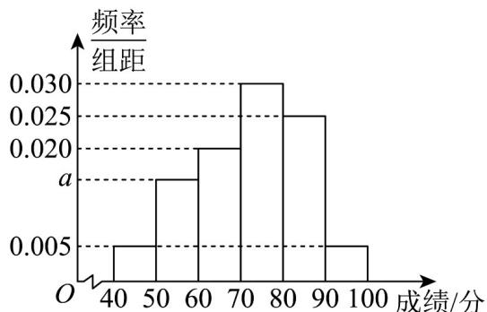

## 题型一：根据频率分布直方图求众数

1．2023年8月8日，世界大学生运动会在成都成功举行闭幕式．某校抽取100名学生进行了大运会知识竞赛并记录得分（满分：100，所有人的成绩都在 $[40,100]$ 内），根据得分将他们的成绩分成 $[40,50),[50,60),[60,70),[70,80),[80,90),[90,100]$ 六组，制成如图所示的频率分布直方图．

(1)求图中 $a$ 的值；

(2)估计这 100 人竞赛成绩的平均数（同一组中的数据用该组区间的中点值为代表）、众数及中位数。
【答案】(1)a = 0.015

(2)平均数 72 分，众数约为 75（分），中位数为 $\frac{220}{3}$ （分）

【分析】（1）由所有频率之和为1列方程即可求解；

(2) 由频率分布直方图中平均数、众数以及中位数的计算公式直接计算即可求解.

【详解】（1）由题意知 $\left(0.005+a+0.020+0.030+0.025+0.005\right)\times10=1$ ，即 $0.085+a=0.1$ ，得a=0.015。
（2）由频率分布直方图可知这100人竞赛成绩的平均数约为 $45\times0.05+55\times0.15+65\times0.20+75\times0.30+85\times0.25+95\times0.05=72$ （分）.
众数约为 $\frac{70+80}{2}=75$ （分）.
前3组的频率为 $0.05+0.15+0.2=0.4$ ，前4组的频率为 $0.05+0.15+0.2+0.3=0.7$ ，
所以中位数为 $70+\frac{0.5-0.4}{0.3}\times10=70+\frac{10}{3}=\frac{220}{3}$ （分）.

![[高中/课堂同步/题库/人教A版高中数学同步讲义(2026)/02_必修第二册/第九章 统计/专题03 频率分布直方图的五大常考题型（高效培优专项训练）数学人教A版高一必修第二册/题型一_根据频率分布直方图求众数/questions/Q00077986.md]]
![[高中/课堂同步/题库/人教A版高中数学同步讲义(2026)/02_必修第二册/第九章 统计/专题03 频率分布直方图的五大常考题型（高效培优专项训练）数学人教A版高一必修第二册/题型一_根据频率分布直方图求众数/questions/Q00077987.md]]
![[高中/课堂同步/题库/人教A版高中数学同步讲义(2026)/02_必修第二册/第九章 统计/专题03 频率分布直方图的五大常考题型（高效培优专项训练）数学人教A版高一必修第二册/题型一_根据频率分布直方图求众数/questions/Q00077988.md]]
![[高中/课堂同步/题库/人教A版高中数学同步讲义(2026)/02_必修第二册/第九章 统计/专题03 频率分布直方图的五大常考题型（高效培优专项训练）数学人教A版高一必修第二册/题型一_根据频率分布直方图求众数/questions/Q00077989.md]]
![[高中/课堂同步/题库/人教A版高中数学同步讲义(2026)/02_必修第二册/第九章 统计/专题03 频率分布直方图的五大常考题型（高效培优专项训练）数学人教A版高一必修第二册/题型一_根据频率分布直方图求众数/questions/Q00077990.md]]
![[高中/课堂同步/题库/人教A版高中数学同步讲义(2026)/02_必修第二册/第九章 统计/专题03 频率分布直方图的五大常考题型（高效培优专项训练）数学人教A版高一必修第二册/题型一_根据频率分布直方图求众数/questions/Q00077991.md]]
