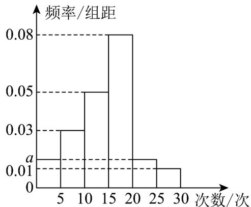

<!-- question-source:start -->
21．某市为了改善交通状况，实行“小红帽”志愿者服务，协助交警参与交通疏导．现对某单位参与志愿服务次数进行统计，随机抽取40名职工作为样本，得到这40名职工参加“小红帽”志愿者服务的次数．根据所得数据，按 $[0,5)$ ， $[5,10)$ ， $[10,15)$ ， $[15,20)$ ， $[20,25)$ ， $[25,30]$ 分成六组，得到如图所示的频率分布直方图．

(1)求图中 $a$ 的值；

(2)若该单位有职工200人，试估计该单位参加志愿服务次数不低于15次的总人数；

(3)试估计该单位职工参与志愿服务次数的中位数.
<!-- question-source:end -->

![[高中/课堂同步/题库/人教A版高中数学同步讲义(2026)/02_必修第二册/第九章 统计/专题03 频率分布直方图的五大常考题型（高效培优专项训练）数学人教A版高一必修第二册/题型三_根据频率分布直方图求中位数/questions/answers/Q00078000A1.md]]
