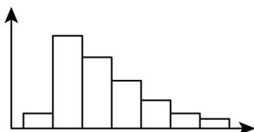
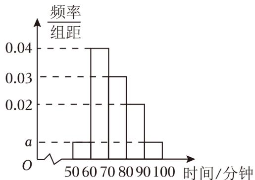
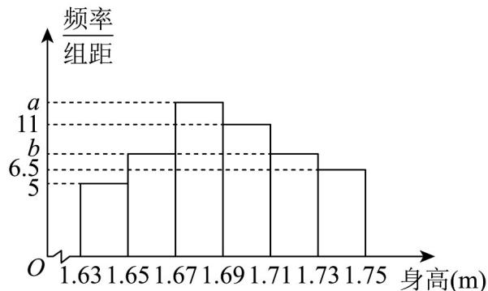
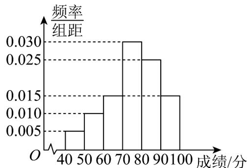

> [!faq]- 《专题03 频率分布直方图的五大常考题型（高效培优专项训练）数学人教A版高一必修第二册》官方解析
>
> > [!success]- **【答案】** 76
>
> > [!note]- **【分析】**
> > 由概率之和为1计算出x后，结合中位数的定义计算即可得.
>
> > [!note]- **【解析】**
> > $\left(0.01+0.016+x+0.022+0.014\right)\times10=1$ ，解得x=0.038，
> > 由 $(0.010+0.016)\times10=0.26<0.5$ ， $(0.010+0.016+0.038)\times10=0.64>0.5$ 设中位数为 x，则 70 < x < 80，
> > 有 $\frac{x-70}{80-70}=\frac{0.5-0.26}{0.64-0.26}$ ，解得 $x=70+\frac{120}{19}\approx76$
> >
> > 故答案为：76.
> >
> > 25．众数、平均数、中位数都描述了数据的集中趋势，它们的大小关系和数据分布的形态有关。在如图所示的分布形态中，平均数、众数和中位数的大小关系是（）（由小到大排列）
> >
> > 
> >
> > A．众数＜中位数＜平均数
> >
> > B. 平均数 $<$ 众数 $<$ 中位数
> > C. 中位数 $<$ 平均数 $<$ 众数
> > D. 众数 $<$ 平均数 $<$ 中位数
> >
> > 【答案】A
> > 【分析】根据直方图矩形高低以及数据的分布趋势，判断即可得出结论。
> > 【详解】众数是最高矩形的中点横坐标，因此众数在第二列的中点处.
> > 因为直方图第二、三列所占数据较多，且在右边拖尾，
> > 所以平均数大于中位数，在第三、四列的位置，因此有众数<中位数<平均数.
> >
> > 故选：A.
> >
> > 26．广汉三星堆半程马拉松比赛是“跑遍四川”德阳站赛事．21.0975公里，每一步都来之不易，每一个向前奔跑的脚步，汇聚成永不停歇的力量，点亮这座城市的精彩．为积极参与马拉松比赛，广汉中学决定从3000名学生随机抽取100名学生进行体能检测，这100名学生进行了15公里的马拉松比赛，比赛成绩（分钟）的频率分布直方图如图所示，其中成绩分布区间是 $\left[50\ 60\right)$ ， $\left[60\ 70\right)$ ， $\left[70\ 80\right)$ ， $\left[80\ 90\right)$ ， $\left[90\ 100\right]$
> >
> > 
> >
> > (1)求图中 $a$ 的值；
> >
> > (2)根据频率分布直方图，估计这100名学生比赛成绩的中位数（结果精确到0.01）；
> >
> > (3)根据样本频率分布直方图，估计该校3000名学生中约有多少名学生能在80分钟内完成15公里马拉松比赛？
> >
> > 【答案】(1)0.005
> >
> > (2)71.67
> >
> > (3)2250
> >
> > 【分析】（1）由频率分布直方图中所有矩形的面积之和为 $1$ 可求得实数的值；
> >
> > (2) 设中位数为 $m$ ，根据中位数的定义可得出相关的等式，解之即可；
> >
> > (3) 求出样本中小于 80 分钟之频率，总数乘以频率可得结果.
> > 【详解】（1）由频率分布直方图中所有矩形的面积之和为 1，
> > 可得 $2a \times 10 + (0.04 + 0.03 + 0.02) \times 10 = 1$ 解得 a = 0.005
> >
> > (2) 前两个矩形的面积之和为 $\left(0.005 + 0.04\right) \times 10 = 0.45 < 0.5$ ，前三个矩形的面积之和为 $\left(0.005 + 0.04 + 0.03\right) \times 10 = 0.75 > 0.5$ ，所以中位数 $m \in (7080)$ ，所以 $0.45 + (m - 70) \times 0.03 = 0.5$ ，解得 $m \approx 71.67$ 。
> >
> > $$
> > \left(0. 0 0 5 + 0. 0 4 + 0. 0 3\right) \times 1 0 = 0. 7 5
> > $$
> >
> > 因此估计该校3000名学生中能在80分钟内完成15公里马拉松比赛的学生人数为 $3000 \times 0.75 = 2250$ 。
> >
> > 27．根据阅兵领导小组办公室介绍，2019年国庆70周年阅兵有59个方（梯）队和联合军乐团，总规模约1.5万人，是近几次阅兵中规模最大的一次．其中，徒步方队15个．为了保证阅兵式时队列保持整齐，各个方队对受阅队员的身高也有着非常严格的限制，太高或太矮都不行．徒步方队队员，男性身高普遍在175cm至185cm之间；女性身高普遍在163cm至175cm之间，这是常规标准．要求最为严格的三军仪仗队，其队员的身高一般都在184cm至190cm之间．经过随机调查某个阅兵阵营中女子100人，得到她们身高的直方图，其中 $a + b = 20$ ．
> >
> > 
> >
> > (1)求直方图中 $a, b$ 的值；
> >
> > (2)估计这个阵营女子身高的平均值；（同一组中的数据用该组区间的中点值为代表）
> >
> > (3)请根据频率分布直方图估计阅兵阵营中女子身高的中位数.
> >
> > 【答案】(1) $a = 12.5$ ， $b = 7.5$ (2)1.6912
> > (3)1.69
> >
> > 【分析】（1）根据频率和为1，即可求解；
> >
> > (2) 根据频率分布直方图，结合平均数的计算公式，即可求解；
> >
> > (3) 结合中位数公式，即可求解.
> >
> > 【详解】（1）由频率分布直方图可知，
> >
> > $\left(5 + b + a + 11 + b + 6.5\right) \times 0.02 = 1$ ，且 $a + b = 20$ ，
> >
> > 解得： $a = 12.5$ ， $b = 7.5$
> >
> > (2) 这个阵营女子身高的平均值为
> >
> > $\left(1.64\times 5 + 1.66\times 7.5 + 1.68\times 12.5 + 1.70\times 11 + 1.72\times 7.5 + 1.74\times 6.5\right)\times 0.02 = 1.6912$
> >
> > (3) 前 3 组的频率和为 $5 \times 0.02 + 7.5 \times 0.02 + 12.5 \times 0.02 = 0.5$
> >
> > 所以中位数为1.69.
> >
> > 28．2023年，贵州“村超”历时三个月，共进行98场比赛，平均每场比赛超5000万人次收看，现场观众超5万人，全网流量突破300亿次．某中学暑假社会实践小组随机抽选6000名网友对“村超”关注度进行问卷调查，并从参加问卷调查的6000人中随机抽取了100人，将他们的问卷成绩（满分100分）分为6组，得到如图所示的频率分布直方图．
> >
> > 
> >
> > (1)记 $A$ 为事件“从参加问卷调查的所有人中随机抽取一名，该网友的成绩不低于80分”，试估计事件 $A$ 发生的概率，并估计参加问卷调查的网友中成绩低于80分的人数；
> >
> > (2)用样本估计总体，求参加问卷调查的6000人成绩的中位数与平均数（同一组中的数据用该组区间的中点值为代表，结果精确到0.1）.
> >
> > 【答案】(1)0.6, 3600
> >
> > (2)中位数为 76.7 分，平均数为 75.5 分
> >
> > 【分析】（1）根据频率分布直方图可计算该网友的成绩不低于80发生的概率，从而得成绩低于80分的概率，即可得成绩低于80分的人数；
> > （2）根据频率分布直方图估计中位数和平均数即可.
> > 【详解】（1）由题图得成绩不低于80分的频率为 $0.025\times10+0.015\times10=0.4$ ，所以 $P(A)=0.4$ 参加问卷调查的网友中成绩低于80分的概率为1-0.4=0.6，
> > 所以估计参加问卷调查的网友中成绩低于80分的人数为 $6000\times0.6=3600$ .
> > （2）由题图知，成绩在 $\left[40,50\right)$ 的频率为 $10\times0.005=0.05$ 在 $\left[50,60\right)$ 的频率为 $10\times0.01=0.1$ ，在 $\left[60,70\right)$ 的频率为 $10\times0.015=0.15$ 在 $\left[70,80\right)$ 的频率为 $10\times0.03=0.3$ ，前3组的频率之和为 $0.05+0.1+0.15=0.3$ 前4组的频率之和为 $0.05+0.1+0.15+0.3=0.6$ ，因此样本的中位数位于第4组，设中位数为x分，
> > 则 $0.05+0.1+0.15+(x-70)\times0.03=0.5$ ，所以 $x\approx76.7$ 样本的平均数为 $45\times0.05+55\times0.1+65\times0.15+75\times0.3+85\times0.25+95\times0.15=75.5$ （分）.
> > 所以参加问卷调查的6000人成绩的中位数为76.7分，平均数为75.5分．
