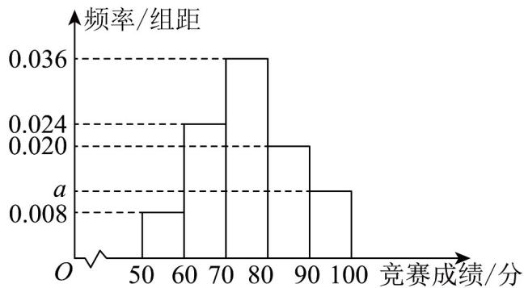

<!-- question-source:start -->
13．某校举办传统文化知识竞赛，从该校参赛学生中随机抽取100名学生，根据他们的竞赛成绩（满分：100分），按[50,60)，[60,70)，[70,80)，[80,90)，[90,100]分成五组，得到如图所示的频率分布直方图.

(1) 估计本次竞赛成绩的平均分为 \_\_\_\_ 分；（同一组中的数据用该组区间的中点值作代表）

（2）该校准备对本次竞赛中分数位于前 $20\%$ 的学生颁发荣誉证书，试问获得荣誉证书的学生分数不低于\_分．
<!-- question-source:end -->

![[高中/课堂同步/题库/人教A版高中数学同步讲义(2026)/02_必修第二册/第九章 统计/专题03 频率分布直方图的五大常考题型（高效培优专项训练）数学人教A版高一必修第二册/题型二_根据频率分布直方图求平均数/questions/answers/Q00077994A1.md]]
