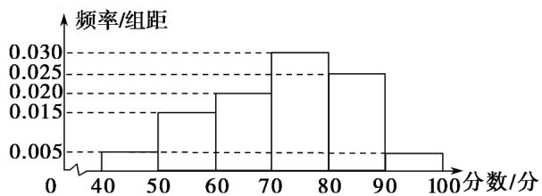

<!-- question-source:start -->
14．某校从参加高二年级学业水平测试的学生中抽出80名学生，其数学成绩（均为整数）的频率分布直方图如图所示，求数学成绩的平均分．

<!-- question-source:end -->

![[高中/课堂同步/题库/人教A版高中数学同步讲义(2026)/02_必修第二册/第九章 统计/专题03 频率分布直方图的五大常考题型（高效培优专项训练）数学人教A版高一必修第二册/题型二_根据频率分布直方图求平均数/questions/answers/Q00077995A1.md]]
