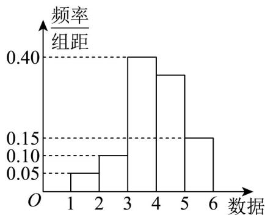
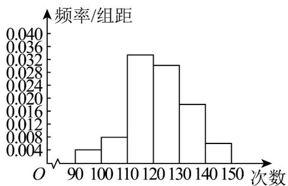

> [!faq]- 《专题03 频率分布直方图的五大常考题型（高效培优专项训练）数学人教A版高一必修第二册》官方解析
>
> > [!success]- **【答案】** 
>
> > [!note]- **【分析】**
> > 根据频率分布直方图中矩形面积为对应频率，结合频数的概念计算即可.
>
> > [!note]- **【解析】**
> > 根据题意，易知样本数据落在 $\left[4,5\right)$ 内的频率为 $1-\left(0.40+0.15+0.10+0.05\right)\times1=0.3$ ，故频数为 $0.3\times1000=300$ 。
> >
> > 50．为了了解高一年级学生的体能情况，某校抽取部分学生进行一分钟跳绳次数测试，将所得数据整理后，画出频率分布直方图（如图所示），图中从左到右各小矩形的面积之比为2:4:17:15:9:3，第二小组的频数为12．
> >
> > 
> >
> > (1)第二小组的频率是多少？样本容量是多少？
> >
> > (2)若次数在 110 以上（含 110 次）为达标，则样本中高一年级学生的达标率约是多少？
> > 【答案】(1)0.08, 150
> > (2)88%
> >
> > 【分析】（1）根据条件计算第二小组对应矩形面积占比即可得出其频率大小，再由频数比频率即得出其样本容量；
> >
> > (2) 根据频率分布直方图计算即可.
> >
> > 【详解】（1）频率分布直方图是以面积的形式来反映数据落在各小组内的频率大小的，
> >
> > 因此第二小组的频率为 $\frac{4}{2 + 4 + 17 + 15 + 9 + 3} = 0.08$
> >
> > $$
> > \text { 因为第二小组的频率 } = \frac {\text { 第二小组的频数 }}{\text { 样本容量 }},
> > $$
> >
> > $$
> > \text { 所以样本容量 } = \frac {\text { 第二小组的频数 }}{\text { 第二小组的频率 }} = \frac {1 2}{0 . 0 8} = 1 5 0
> > $$
> >
> > (2) 由频率分布直方图可得样本中高一年级学生的达标率约为
> >
> > $$
> > \frac {17 + 15 + 9 + 3}{2 + 4 + 17 + 15 + 9 + 3} \times 100 \% = 88 \% .
> > $$
