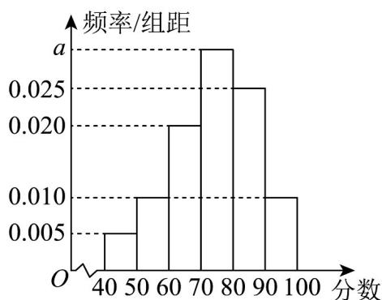

## 题型五：根据频率分布直方图求频数、频率

41．为传承和弘扬数学文化，激发学生学习数学的兴趣，某校高一年级组织开展数学文化知识竞赛·从参赛的2000名考生成绩中随机抽取100个成绩进行统计，得到如图所示的频率分布直方图，其中90分以上视

为优秀，则频率/组距（）

A. $a$ 的值为0.030
B．抽取的考生成绩的极差介于40分至60分之间
C．2000名考生中约有10名成绩优秀
D．估计有一半以上的考生的成绩介于70分至90分之间

【答案】ABD

【分析】根据频率之和为1、极差、优秀率、频率等知识对选项进行分析，从而确定正确答案。
【详解】依题意， $\left(0.005+0.010+0.020+a+0.025+0.010\right)'10=1$ 解得 a = 0.030，A 选项正确.
根据频率分布直方图，90 - 50 = 40, 100 - 40 = 60
所以极差介于40分至60分之间，B选项正确.
90 分以上频率为 0.1 ，对应有 $2000 \times 0.1 = 200$ 人，C 选项错误.
成绩介于70分至90分之间的频率为 $0.3 + 0.25 = 0.55$ 所以估计有一半以上的考生的成绩介于70分至90分之间，D选项正确.

故选：ABD

![[高中/课堂同步/题库/人教A版高中数学同步讲义(2026)/02_必修第二册/第九章 统计/专题03 频率分布直方图的五大常考题型（高效培优专项训练）数学人教A版高一必修第二册/题型五_根据频率分布直方图求频数_频率/questions/Q00078008.md]]
![[高中/课堂同步/题库/人教A版高中数学同步讲义(2026)/02_必修第二册/第九章 统计/专题03 频率分布直方图的五大常考题型（高效培优专项训练）数学人教A版高一必修第二册/题型五_根据频率分布直方图求频数_频率/questions/Q00078009.md]]
![[高中/课堂同步/题库/人教A版高中数学同步讲义(2026)/02_必修第二册/第九章 统计/专题03 频率分布直方图的五大常考题型（高效培优专项训练）数学人教A版高一必修第二册/题型五_根据频率分布直方图求频数_频率/questions/Q00078010.md]]
![[高中/课堂同步/题库/人教A版高中数学同步讲义(2026)/02_必修第二册/第九章 统计/专题03 频率分布直方图的五大常考题型（高效培优专项训练）数学人教A版高一必修第二册/题型五_根据频率分布直方图求频数_频率/questions/Q00078011.md]]
![[高中/课堂同步/题库/人教A版高中数学同步讲义(2026)/02_必修第二册/第九章 统计/专题03 频率分布直方图的五大常考题型（高效培优专项训练）数学人教A版高一必修第二册/题型五_根据频率分布直方图求频数_频率/questions/Q00078012.md]]
![[高中/课堂同步/题库/人教A版高中数学同步讲义(2026)/02_必修第二册/第九章 统计/专题03 频率分布直方图的五大常考题型（高效培优专项训练）数学人教A版高一必修第二册/题型五_根据频率分布直方图求频数_频率/questions/Q00078013.md]]
