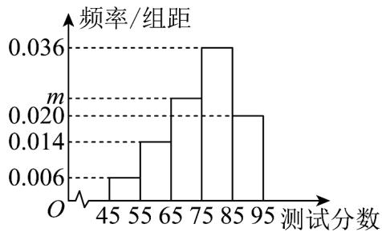

<!-- question-source:start -->
37．某学校为了了解高二年级学生数学运算能力，对高二年级的200名学生进行了一次测试。已知参加此次测试的学生的分数 $x_{i}(i=1,2,3,\cdots,200)$ 全部介于45分到95分之间，该校将所有分数分成5组：[45,55)，[55,65)，……，[85,95]，整理得到如下频率分布直方图（同组数据以这组数据的中间值作为代表）.

(1)求 $m$ 的值，并估计此次校内测试分数的平均值 $\overline{x}$ ；

(2)试估计这 200 名学生的分数 $x_{i}(i = 1,2,3,\dots ,200)$ 的方差 $s^2$ ，并判断此次得分为 52 分和 94 分的两名同学的成绩是否进入到了 $[\overline{x} - 2s,\overline{x} + 2s]$ 范围内？（参考数据： $\sqrt{129} \approx 11.4$ ）
<!-- question-source:end -->

![[高中/课堂同步/题库/人教A版高中数学同步讲义(2026)/02_必修第二册/第九章 统计/专题03 频率分布直方图的五大常考题型（高效培优专项训练）数学人教A版高一必修第二册/题型四_根据频率分布直方图求方差_标准差/questions/answers/Q00078005A1.md]]
