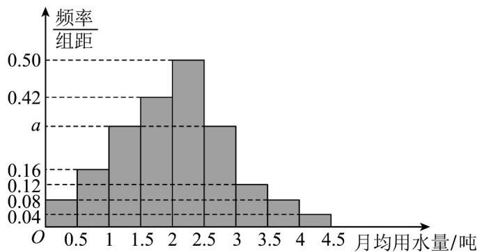

<!-- question-source:start -->
38．某市为了制定合理的节水方案，对居民用水情况进行了调查．通过抽样，获得了某年100户居民每人的月均用水量（单位：吨）将数据按照 $[0,0.5)$ ， $[0.5,1)$ ，…， $[4,4.5]$ 分成9组，制成了如下图所示的频率分布直方图．

(1)求直方图中 $a$ 的值；

(2)用每组区间的中点作为每组用水量的平均值，这9组居民每人的月均用水量前四组的方差都为0.3，后5组的方差都为0.4，求这100户居民月均用水量的方差。
<!-- question-source:end -->

![[高中/课堂同步/题库/人教A版高中数学同步讲义(2026)/02_必修第二册/第九章 统计/专题03 频率分布直方图的五大常考题型（高效培优专项训练）数学人教A版高一必修第二册/题型四_根据频率分布直方图求方差_标准差/questions/answers/Q00078006A1.md]]
