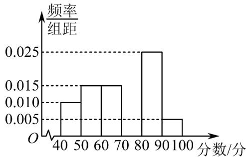

<!-- question-source:start -->
39. 某中学组织了数学知识竞赛，从参加考试的学生中抽出40名学生，将其成绩（均为整数）分成六组

$[40,50), [50,60), ..., [90,100]$ ，其部分频率分布直方图如图所示。观察图形，回答下列问题。

(1)求成绩在 $[70,80)$ 的频率，并补全这个频率分布直方图；

(2)估计这次考试成绩的众数，平均分和方差.
<!-- question-source:end -->

![[高中/课堂同步/题库/人教A版高中数学同步讲义(2026)/02_必修第二册/第九章 统计/专题03 频率分布直方图的五大常考题型（高效培优专项训练）数学人教A版高一必修第二册/题型四_根据频率分布直方图求方差_标准差/questions/answers/Q00078007A1.md]]
