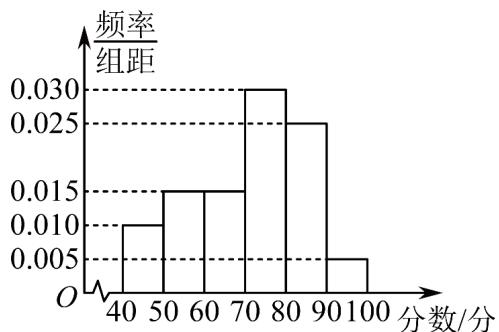
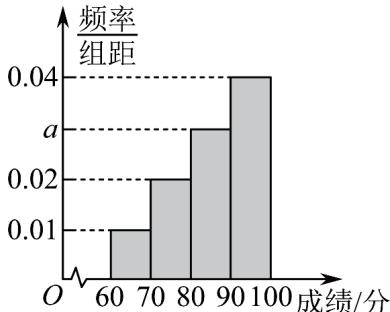

> [!faq]- 《专题03 频率分布直方图的五大常考题型（高效培优专项训练）数学人教A版高一必修第二册》官方解析
>
> > [!success]- **【答案】** (1)0.3，直方图见解析 (2)众数为 75，平均分为 71 分，方差 194。
>
> > [!note]- **【分析】**
> > （1）根据各组的频率和为1可求出[70,80)的频率，从而可补全频率分布直方图；
> >
> > (2) 根据众数，平均分和方差的定义结合频率分布直方图求解.
>
> > [!note]- **【解析】**
> > （1）因为各组的频率之和等于1，所以成绩在 $[70,80)$ 的频率为
> >
> > $$
> > 1 - (0. 0 2 5 + 0. 0 1 5 \times 2 + 0. 0 1 + 0. 0 0 5) \times 1 0 = 0. 3
> > $$
> >
> > 补全频率分布直方图如图所示：
> >
> > 
> >
> > (2) 由频率分布直方图可得，这次考试成绩在区间 $\lfloor 70,80\rfloor$ 内的最多，因此这次考试成绩的众数为 $75$ 利用中值估算学生成绩的平均分： $45 \times 0.1 + 55 \times 0.15 + 65 \times 0.15 + 75 \times 0.3 + 85 \times 0.25 + 95 \times 0.05 = 71$ ，方差： $(45 - 71)^{2} \times 0.1 + (55 - 71)^{2} \times 0.15 + (65 - 71)^{2} \times 0.15 + (75 - 71)^{2} \times 0.3 + (85 - 71)^{2} \times 0.25 + (95 - 71)^{2} \times 0.05 = 194$ ，所以本次考试的众数为 $75$ ，平均分为 $71$ 分，方差 $194$ 。40．某学校组织学生参加数学测试，某班成绩的频率分布直方图如图，数据的分组依次为
> >
> > 
> >
> > [60,70), [70,80), [80,90), [90,100]. 若不低于80分的人数是35人，且同一组中的数据用该组区间的中点值代表，则下列说法中正确的是（ ）
> > 频率
> > 组距
> > a
> > 0.04
> > 0.02
> > 0.01
> > O 60 70 80 90 100 成绩/分
> > A．该班的学生人数是50
> > B．成绩在[80,90)的学生人数是12
> > C．估计该班成绩的众数是95分
> > D．估计该班成绩的方差为100
> >
> > 【答案】ACD
> >
> > 【分析】根据频率与总数关系、频率和为1、频率分布直方图估计众数、平均数和方差的方法依次判断各个选项即可.
> > 【详解】对于 A，∵ 不低于 80 分对应的频率为 $1 - (0.01 + 0.02) \times 10 = 0.7$ ，
> > ∴ 该班的学生人数为 $\frac{35}{0.7} = 50$ ，A 正确；
> > 对于 B，∵ $(0.01 + 0.02 + a + 0.04) \times 10 = 1$ ，∴ a = 0.03，
> > ∴ 成绩在 $[80,90)$ 的学生人数为 $50a \times 10 = 15$ ，B 错误；
> > 对于 C，∵ 成绩在 $[90,100]$ 对应的矩形面积最大，∴ 估计该班成绩的众数为 95 分，C 正确；
> > 对于 D，∵ 估计该班成绩的平均数为 $65 \times 0.01 \times 10 + 75 \times 0.02 \times 10 + 85 \times 0.03 \times 10 + 95 \times 0.04 \times 10 = 85$ ∴ 方差为 $0.01 \times 10 \times (65 - 85)^{2} + 0.02 \times 10 \times (75 - 85)^{2} + 0.03 \times 10 \times (85 - 85)^{2} + 0.04 \times 10 \times (95 - 85)^{2} = 100$ ，D 正确.
> >
> > 故选 **ACD**.
