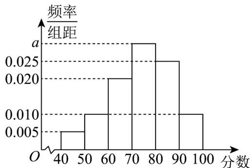
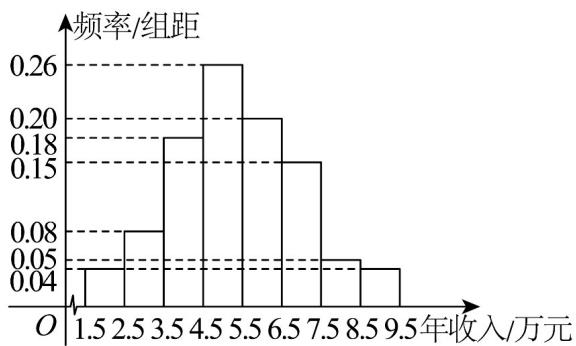
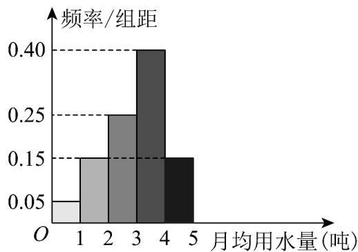
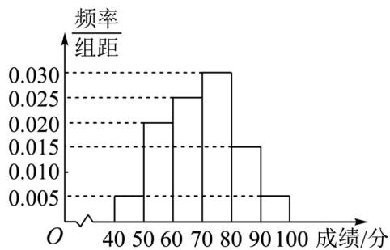
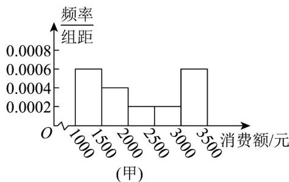
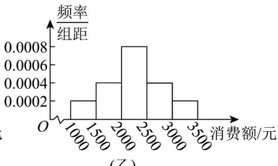
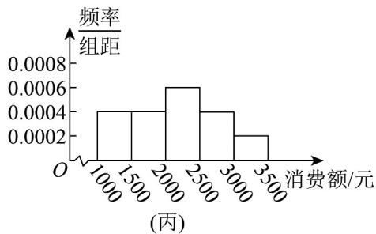

## 题型四：根据频率分布直方图求方差、标准差

31．文明城市是反映城市整体文明水平的综合性荣誉称号，作为普通市民，既是文明城市的最大受益者，更是文明城市的主要创造者。某市为提高市民对文明城市创建的认识，举办了“创建文明城市”知识竞赛，从所有答卷中随机抽取100份作为样本，将样本的成绩（满分100分，成绩均为不低于40分的整数）分成六段：[40,50), [50,60), …, [90,100]得到如图所示的频率分布直方图。

(1)求频率分布直方图中 $a$ 的值；

(2)求样本成绩的第75百分位数；

(3)已知落在 $[50,60)$ 的平均成绩是 56，方差是 7，落在 $[60,70)$ 的平均成绩为 65，方差是 4，求两组成绩的总平均数 $\overline{z}$ 和总方差 $s^2$ .

【答案】(1)0.030

(2)84

(3)总平均数是62，总方差是23.

【分析】（1）利用小矩形的面积之和为 1，进行求解；

(2) 先判断第 75 百分位数在 [40.90)，然后列方程可求得结果；

(3) 由频率分布直方图中数据结合方差计算公式即可解答.

【详解】（1）每组小矩形的面积之和为1，

$$
\therefore (0. 0 0 5 + 0. 0 1 0 + 0. 0 2 0 + a + 0. 0 2 5 + 0. 0 1 0) \times 1 0 = 1
$$

$\therefore a = 0.030$

(2) 成绩落在 $[40.80)$ 内的频率为 $(0.005 + 0.010 + 0.020 + 0.030) \times 10 = 0.65$ 落在 $[40.90)$ 内的频率为 $(0.005 + 0.010 + 0.020 + 0.030 + 0.025) \times 10 = 0.9$ 设第75百分位数为 $m$ 由 $0.65 + (m - 80) \times 0.025 = 0.75$ 得 $m = 84$ ，故第75百分位数为84；

（3）由频率分布直方图知，成绩在 $[50,60)$ 的市民人数为 $100 \times 0.1 = 10$ ，成绩在 $[60,70)$ 的市民人数为 $100 \times 0.2 = 20$ ，所以 $\overline{z} = \frac{10 \times 56 + 20 \times 65}{10 + 20} = 62$ ；由样本方差计算总体方差公式，得总方差为 $s^2 = \frac{1}{10 + 20}\left\{10[7 + (56 - 62)^2] + 20[4 + (65 - 62)^2]\right\} = 23$

32．随着老年人消费需求从“生存型”向“发展型”转变．消费层次不断提升，“银发经济”成为社会热门话题之一，被各企业持续关注．某企业为了解该地老年人消费能力情况，对该地年龄在 $\left[60,80\right)$ 的老年人的年收入按年龄 $\left[60,70\right)$ ， $\left[70,80\right)$ 分成两组进行分层抽样调查，已知抽取了年龄在 $\left[60,70\right)$ 的老年人500人．年龄在 $\left[70,80\right)$ 的老年人300人．现作出年龄在 $\left[60,70\right)$ 的老年人年收入的频率分布直方图（如图所示）：

(1)根据频率分布直方图，若每个区间取中点值为代表，估计该地年龄在 $\left[60,70\right)$ 的老年人年收入的平均数及第95百分位数；

(2)已知年龄在 $[60,70)$ 的老年人年收入的方差为3，年龄在 $[70,80)$ 的老年人年收入的平均数和方差分别为3.75和1.4，试估计年龄在 $[60,80)$ 的老年人年收入的方差。（请先推导必要的公式，再代值计算）

(2) $^{3}$

【分析】（1）根据频率分布直方图直接计算即可；

（2）先根据方差的性质推出公式 $\sigma^2 = \frac{m\sigma_1^2 + n\sigma_2^2}{m + n} +\frac{m\mu_1^2 + n\mu_2^2}{m + n} -\left(\frac{m\mu_1 + n\mu_2}{m + n}\right)^2$ ，再代入题目中的数据计算即可.

【详解】（1）根据频率分布直方图，平均数为

$$
2 \times 0. 0 4 + 3 \times 0. 0 8 + 4 \times 0. 1 8 + 5 \times 0. 2 6 + 6 \times 0. 2 0 + 7 \times 0. 1 5 + 8 \times 0. 0 5 + 9 \times 0. 0 4 = 5. 3 5
$$

而由于 $0.04 + 0.08 + 0.18 + 0.26 + 0.20 + 0.15 = 0.91 < 0.95$

$$
0. 0 4 + 0. 0 8 + 0. 1 8 + 0. 2 6 + 0. 2 0 + 0. 1 5 + 0. 0 5 = 0. 9 6 > 0. 9 5
$$

故第95百分位数在区间第95百分位数内，设其为 $7.5 + x(0 < x < 1)$ .

$$
0. 0 4 + 0. 0 8 + 0. 1 8 + 0. 2 6 + 0. 2 0 + 0. 1 5 + 0. 0 5 x = 0. 9 5 \text {, 得} x = 0. 8
$$

所以第95百分位数为 $7.5 + 0.8 = 8.3$

（2）先证明一个结论：对 $m, n \in \mathbb{N}^*$ ，设数据 $x_1, x_2, \ldots, x_m$ 的平均值和方差分别为 $\mu_1, \sigma_1^2$ ，数据 $y_1, y_2, \ldots, y_n$ 的平均值和方差分别为 $\mu_2, \sigma_2^2$ ，则数据 $x_1, x_2, \ldots, x_m, y_1, y_2, \ldots, y_n$ 的平均值和方差分别为 $\frac{m\mu_1 + n\mu_2}{m + n}$ 和 $\frac{m\sigma_1^2 + n\sigma_2^2}{m + n} + \frac{m\mu_1^2 + n\mu_2^2}{m + n} - \left(\frac{m\mu_1 + n\mu_2}{m + n}\right)^2$ .

证明：设数据 $x_{1}, x_{2}, \ldots, x_{m}, y_{1}, y_{2}, \ldots, y_{n}$ 的平均值和方差分别为 $\mu, \sigma^{2}$ ，则 $\mu = \frac{x_1 + x_2 + \ldots + x_m + y_1 + y_2 + \ldots + y_n}{m + n}$ $= \frac{m}{m + n} \cdot \frac{x_1 + x_2 + \ldots + x_m}{m} + \frac{n}{m + n} \cdot \frac{y_1 + y_2 + \ldots + y_n}{n}$ $= \frac{m}{m + n} \mu_1 + \frac{n}{m + n} \mu_2 = \frac{m \mu_1 + n \mu_2}{m + n}$ .

由于方差 $D(X) = E\left((X - EX)^2\right) = E\left(X^2 - 2EX \cdot X + (EX)^2\right) = E\left(X^2\right) - 2EX \cdot EX + (EX)^2 = E\left(X^2\right) - (EX)^2$ .

故 $\sigma_1^2 = \frac{x_1^2 + x_2^2 + \ldots + x_m^2}{m} - \left(\frac{x_1 + x_2 + \ldots + x_m}{m}\right)^2$ ， $\sigma_2^2 = \frac{y_1^2 + y_2^2 + \ldots + y_n^2}{n} - \left(\frac{y_1 + y_2 + \ldots + y_n}{n}\right)^2$ ，且 $\sigma^2 = \frac{x_1^2 + x_2^2 + \ldots + x_m^2 + y_1^2 + y_2^2 + \ldots + y_n^2}{m + n} - \left(\frac{x_1 + x_2 + \ldots + x_m + y_1 + y_2 + \ldots + y_n}{m + n}\right)^2$ .

所以 $\sigma^2 = \frac{x_1^2 + x_2^2 + \ldots + x_m^2 + y_1^2 + y_2^2 + \ldots + y_n^2}{m + n} - \left(\frac{x_1 + x_2 + \ldots + x_m + y_1 + y_2 + \ldots + y_n}{m + n}\right)^2$ $= \frac{m}{m + n} \cdot \frac{x_1^2 + x_2^2 + \ldots + x_m^2}{m} + \frac{n}{m + n} \cdot \frac{y_1^2 + y_2^2 + \ldots + y_n^2}{n} - \mu^2$

$$
\begin{array}{l} = \frac {m}{m + n} \cdot \left(\frac {x _ {1} ^ {2} + x _ {2} ^ {2} + \ldots + x _ {m} ^ {2}}{m} - \left(\frac {x _ {1} + x _ {2} + \ldots + x _ {m}}{m}\right) ^ {2} + \mu_ {1} ^ {2}\right) + \frac {n}{m + n} \cdot \left(\frac {y _ {1} ^ {2} + y _ {2} ^ {2} + \ldots + y _ {n} ^ {2}}{n} - \left(\frac {y _ {1} + y _ {2} + \ldots + y _ {n}}{n}\right) ^ {2} + \mu_ {2} ^ {2}\right) - \mu^ {2} \\ = \frac {m}{m + n} \cdot \left(\sigma_ {1} ^ {2} + \mu_ {1} ^ {2}\right) + \frac {n}{m + n} \cdot \left(\sigma_ {2} ^ {2} + \mu_ {2} ^ {2}\right) - \left(\frac {m \mu_ {1} + n \mu_ {2}}{m + n}\right) ^ {2} \\ = \frac {m \sigma_ {1} ^ {2} + n \sigma_ {2} ^ {2}}{m + n} + \frac {m \mu_ {1} ^ {2} + n \mu_ {2} ^ {2}}{m + n} - \left(\frac {m \mu_ {1} + n \mu_ {2}}{m + n}\right) ^ {2}. \end{array}
$$

这就证明了结论.

回到原题，本题中 $m = 500$ ， $n = 300$ ， $\mu_{1} = 5.35$ ， $\sigma_1^2 = 3$ ， $\mu_{2} = 3.75$ ， $\sigma_2^2 = 1.4$

代入数值即知所求方差为

$$
\sigma^ {2} = \frac {5 0 0 \times 3 + 3 0 0 \times 1 . 4}{5 0 0 + 3 0 0} + \frac {5 0 0 \times 5 . 3 5 ^ {2} + 3 0 0 \times 3 . 7 5 ^ {2}}{5 0 0 + 3 0 0} - \left(\frac {5 0 0 \times 5 . 3 5 + 3 0 0 \times 3 . 7 5}{5 0 0 + 3 0 0}\right) ^ {2} = 3.
$$

33．为了解某地区居民用水情况，通过抽样，获得了100位居民每人的月均用水量（单位：吨），将数据按照 $[0,1),[1,2),\cdots,[4,5]$ 分成5组，制成了如图所示的频率分布直方图．

(1)估计这 100 位居民月均用水量的样本平均数 $\overline{x}$ 和样本方差 $s^2$ （同一组数据用该区间的中点值作代表，保留 1 位小数）.

(2)根据以上抽样调查数据，能否认为该地区居民每人的月均用水量符合“月均用水量超过3吨的人数不能超过全部人数的 $30\%$ ”的规定？

【答案】(1) $\overline{x}\approx3.0,\quad s^{2}\approx1.2$

(2)不能认为

【分析】（1）利用频率分布直方图即可估计这100位居民月均用水量的样本平均数和样本方差 $s^2$

(2) 求出月均用水量超过 3 吨的人数占全部人数的百分比，由此可得结论.

【详解】（1）估计这 100 位居民月均用水量的样本平均数：

$$
\overline {{{{x}}}} = 0. 5 \times 0. 0 5 + 1. 5 \times 0. 1 5 + 2. 5 \times 0. 2 5 + 3. 5 \times 0. 4 + 4. 5 \times 0. 1 5 \approx 3. 0
$$

样本方差为 $s^2 = (3 - 0.5)^2 \times 0.05 + (3 - 1.5)^2 \times 0.15 + (3 - 2.5)^2 \times 0.25 + (3 - 3.5)^2 \times 0.4 + (3 - 4.5)^2 \times 0.15 \approx 1.2$

(2) 月均用水量超过 $3$ 吨的人数占全部人数的百分比为： $(0.4 + 0.15) \times 100\% = 55\% > 30\%$

∴该地区居民每人的月均用水量不符合“月均用水量超过3吨的人数不能超过全部人数30%”的规定.

34．为迎接冬季长跑比赛，重庆八中对全体高二学生举行了一次关于冬季长跑相关知识的测试，统计人员从高二学生中随机抽取100名学生的成绩作为样本进行统计，测试满分为100分，统计后发现所有学生的测试成绩都在区间 $[40,100]$ 内，并制成如图所示的频率分布直方图．

(1)估计这 100 名学生的平均成绩；

(2)若在区间 $[70,80)$ 内的学生测试成绩的平均数和方差为 $74$ 和 $26$ ，在区间 $[80,100]$ 内的学生测试成绩的平均数和方差为 $89$ 和 $106$ ，据此估计在 $[70,100]$ 内的所有学生测试成绩的平均数和方差．

【答案】(1)69.5 分

(2)平均数80，方差112

【分析】（1）根据频率分布直方图直接求平均数即可；

(2) 利用平均数和方差公式直接计算求解即可.

【详解】（1）由图表可知，这100名学生的平均成绩为

$$
1 0 \times (4 5 \times 0. 0 0 5 + 5 5 \times 0. 0 2 + 6 5 \times 0. 0 2 5 + 7 5 \times 0. 0 3 + 8 5 \times 0. 0 1 5 + 9 5 \times 0. 0 0 5) = 6 9. 5
$$

(2) 在区间 $[70,80)$ 内的学生测试成绩的平均数和方差为 74 和 26，

区间 $[70,80)$ 的学生频率为 $0.03\times 10 = 0.3$

在区间 $[80,100]$ 内的学生测试成绩的平均数和方差为89和106，

区间 $[80,100]$ 的学生频率为 $(0.015 + 0.005)\times 10 = 0.2$

所以在[70,100]内的所有学生测试成绩的平均数为 $74 \times \frac{0.3}{0.3 + 0.2} + 89 \times \frac{0.2}{0.3 + 0.2} = 44.4 + 35.6 = 80$

方差为 $\frac{3}{5} \times \left[26 + (74 - 80)^2\right] + \frac{2}{5} \times \left[106 + (89 - 80)^2\right] = 37.2 + 74.8 = 112$

35．为了解本书居民的生活成本，甲、乙、丙三名同学利用假期分别对三个社区进行了“家庭每月日常消费额”的调查。他们将调查所得的数据分别绘制成频率分布直方图（如图所示），记甲、乙、丙所调查数据的标准差分别为 $S_{1}$ ， $S_{2}$ ， $S_{3}$ ，则它们的大小关系为\_\_\_\_。（用“<”连接）

(乙)

【答案】 $S_{2} <   S_{3} <   S_{1}$

【分析】根据平均数公式及方差公式分别计算 $s_1^2$ 、 $s_2^2$ 、 $s_3^2$ ，即可判断；

【详解】由图甲：平均值为

$\overline{x_1} = 500(1250\times 0.0006 + 1750\times 0.0004 + 2250\times 0.0002 + 2750\times 0.0002 + 3250\times 0.0006) = 2200$ $s_1^2 = (1250 - 2200)^2\times 0.3 + (1750 - 2200)^2\times 0.2 + (2250 - 2200)^2\times 0.1$ $+(2750 - 2200)^2\times 0.1 + (3250 - 2200)^2\times 0.3$ $= 672500$ $\overline{x_2} = 1250\times 0.1 + 1750\times 0.2 + 2250\times 0.4 + 2750\times 0.2 + 3250\times 0.1 = 2250$ $s_2^2 = (1250 - 2250)^2\times 0.1 + (1750 - 2250)^2\times 0.2 + (2250 - 2250)^2\times 0.4$ $+(2750 - 2250)^2\times 0.2 + (3250 - 2250)^2\times 0.1$ $= 300000$ $\overline{x_3} = 1250\times 0.2 + 1750\times 0.2 + 2250\times 0.3 + 2750\times 0.2 + 3250\times 0.1 = 2150$ $s_3^2 = (1250 - 2150)^2\times 0.2 + (1750 - 2150)^2\times 0.2 + (2250 - 2150)^2\times 0.3$

$+ (2750 - 2150)^{2} \times 0.2 + (3250 - 2150)^{2} \times 0.1$ =390000,

则标准差 $S_{2} < S_{3} < S_{1}$ ，

故答案为： $S_{2}<S_{3}<S_{1}$

![[高中/课堂同步/题库/人教A版高中数学同步讲义(2026)/02_必修第二册/第九章 统计/专题03 频率分布直方图的五大常考题型（高效培优专项训练）数学人教A版高一必修第二册/题型四_根据频率分布直方图求方差_标准差/questions/Q00078004.md]]
![[高中/课堂同步/题库/人教A版高中数学同步讲义(2026)/02_必修第二册/第九章 统计/专题03 频率分布直方图的五大常考题型（高效培优专项训练）数学人教A版高一必修第二册/题型四_根据频率分布直方图求方差_标准差/questions/Q00078005.md]]
![[高中/课堂同步/题库/人教A版高中数学同步讲义(2026)/02_必修第二册/第九章 统计/专题03 频率分布直方图的五大常考题型（高效培优专项训练）数学人教A版高一必修第二册/题型四_根据频率分布直方图求方差_标准差/questions/Q00078006.md]]
![[高中/课堂同步/题库/人教A版高中数学同步讲义(2026)/02_必修第二册/第九章 统计/专题03 频率分布直方图的五大常考题型（高效培优专项训练）数学人教A版高一必修第二册/题型四_根据频率分布直方图求方差_标准差/questions/Q00078007.md]]
