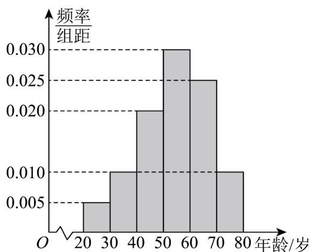

<!-- question-source:start -->
7. 某居民小区为了提高小区居民的读书兴趣，特举办读书活动，准备进一定量的书籍丰富小区图书站。由于不同年龄段需看不同类型的书籍，为了合理配备资源，现对小区内读书者进行年龄调查，随机抽取了一天中40名读书者进行调查，将他们的年龄分成6段： $[20,30)$ ， $[30,40)$ ， $[40,50)$ ， $[50,60)$ ， $[60,70)$ ， $[70,80]$ ，得到的频率分布直方图如图所示。

(1)估计这40名读书者中年龄分布在区间[40,70)上的人数；

(2)估计这40名读书者年龄的众数和第80百分位数；
<!-- question-source:end -->

![[高中/课堂同步/题库/人教A版高中数学同步讲义(2026)/02_必修第二册/第九章 统计/专题04 样本估计总体的五大常考题型（高效培优专项训练）数学人教A版高一必修第二册/题型一_总体百分位数的估计/questions/answers/Q00078018A1.md]]
