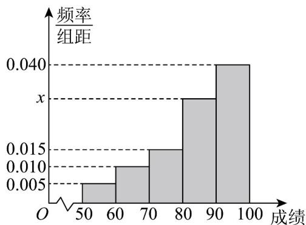

> [!faq]- 《专题04 样本估计总体的五大常考题型（高效培优专项训练）数学人教A版高一必修第二册》官方解析
>
> > [!success]- **【答案】** A. 极差是5 B. 众数是12 C. 均值是12 D. 50%分位数是12.5
>
> > [!note]- **【分析】**
> > 对于 A，根据极差的定义分析判断，对于 B，根据众数的定义分析判断，对于 C，根据平均数的定义计算判断，对于 D，根据百分位数的定义计算判断.
>
> > [!note]- **【解析】**
> > 对于 A，这 7 个数的极差为 14 - 9 = 5，所以 A 正确，
> > 对于 B，这 7 个数的众数为 12 和 14，所以 B 错误，
> > 对于 C，这 7 个数的均值为 $\frac{9+13+12+12+14+10+14}{7}=12$ ，所以 C 正确，
> >
> > 对于 D，这 7 个数从小到大排列依次为 9，10，12，12，13，14，14，因为 $7 \times 50\% = 3.5$ ，所以这组数的 50% 分位数是 12，所以 D 错误.
> > 故选：AC
> >
> > 5. 高一（1）班7人宿舍中每个同学的身高分别为 $170, 168, 175, 172, 172, 176, 180$ ，则这7人的第40百分位数为（）
> >
> > 【答案】
> > A. 168 B. 170 C. 172 D. 171
> >
> > 【答案】C
> > 【分析】将数据按升序排列，结合百分位数的定义运算求解即可.
> > 【详解】将数据按升序排列可得 $168, 170, 172, 172, 175, 176, 180$ ，因为 $7 \times 0.4 = 2.8$ ，所以这7人的第40百分位数为第3位数172.
> >
> > 故选：C.
> >
> > 6．梵净山位于贵州省铜仁市的江口、印江、松桃三县交界处，是具有2000多年历史的文化名山·梵净山山势雄伟、层峦叠嶂，溪流纵横、飞瀑悬泻·为更好地提升旅游品质，随机选择100名游客对景区进行满意度评分（满分100分），根据评分，制成如图所示的频率分布直方图.
> >
> > 
> >
> > (1)根据频率分布直方图，求 $x$ 的值；
> >
> > (2)估计这 100 名游客对景区满意度评分的 70% 分位数.
> >
> > $$
> > x = 0. 0 3 \tag {1}
> > $$
> >
> > 【分析】（1）根据直方图中频率和为1即可求解；
> >
> > (2) 由百分位数的定义，结合直方图即可求解；
> >
> > 【详解】（1）由图可知： $10 \times (0.005 + 0.01 + 0.015 + x + 0.04) = 1$ ，解得：x = 0.03。
> >
> > (2) 根据频率分布直方图可知：
> >
> > $$
> > 1 0 \times (0. 0 0 5 + 0. 0 1 + 0. 0 1 5 + 0. 0 3) = 0. 6 <   0. 7
> > $$
> >
> > $$
> > 0. 7 <   1 0 \times (0. 0 0 5 + 0. 0 1 + 0. 0 1 5 + 0. 0 3 + 0. 0 4) = 1
> > $$
> >
> > 所以 $70\%$ 分位数在区间 $[90,100]$ 内，令其为 $m$ ，
> >
> > 则 $0.6 + 0.04 \times (m - 90) = 0.7$
> >
> > 解得： $m = 92.5$
> >
> > 所以满意度评分的 70% 分位数为 92.5.
