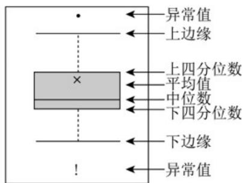
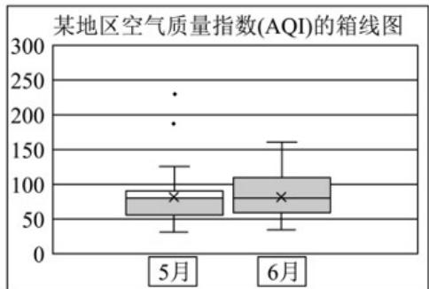

## 题型三：用中位数的代表解决实际问题

21．箱线图是用来表示一组或多组数据分布情况的统计图，因形似箱子而得名·在箱线图中（如图1），箱体中部的粗实线表示中位数；中间箱体的上、下底，分别是数据的上四分位数（75%分位数）和下四分位数（25%分位数）；整个箱体的高度为四分位距；位于最下面和最上面的实横线分别表示最小值和最大值（有时候箱子外部会有一些点，它们是数据中的异常值）·图2为某地区2023年5月和6月的空气质量指数（AQI）箱线图·AQI值越小，空气质量越好；AQI值超过200，说明污染严重·则（）

【答案】

图1

图2

A. 该地区2023年5月有严重污染天气
B. 该地区2023年6月的AQI值比5月的AQI值集中
C. 该地区2023年5月的AQI值比6月的AQI值集中

D．从整体上看，该地区2023年5月的空气质量略好于6月

【答案】ACD

【分析】根据给定信息，结合图示，逐项判断即得.

【详解】对于 A，图 2 所示中 5 月份有 AQI 值超过 200 的异常值，A 正确；

对于B，C，图2中5月份的箱体高度比6月份的箱体高度小，说明5月的AQI值比6月的AQI值集中，B

错误，C 正确；

对于 D，虽然 5 月有严重污染天气，但从图 2 所示中 5 月份箱体整体上比 6 月份箱体偏下且箱体高度小，

AQI 值整体集中于较小值，说明从整体上看，该地区 2023 年 5 月的空气质量略好于 6 月，D 正确.

故选：ACD

![[高中/课堂同步/题库/人教A版高中数学同步讲义(2026)/02_必修第二册/第九章 统计/专题04 样本估计总体的五大常考题型（高效培优专项训练）数学人教A版高一必修第二册/题型三_用中位数的代表解决实际问题/questions/Q00078028.md]]
![[高中/课堂同步/题库/人教A版高中数学同步讲义(2026)/02_必修第二册/第九章 统计/专题04 样本估计总体的五大常考题型（高效培优专项训练）数学人教A版高一必修第二册/题型三_用中位数的代表解决实际问题/questions/Q00078029.md]]
![[高中/课堂同步/题库/人教A版高中数学同步讲义(2026)/02_必修第二册/第九章 统计/专题04 样本估计总体的五大常考题型（高效培优专项训练）数学人教A版高一必修第二册/题型三_用中位数的代表解决实际问题/questions/Q00078030.md]]
![[高中/课堂同步/题库/人教A版高中数学同步讲义(2026)/02_必修第二册/第九章 统计/专题04 样本估计总体的五大常考题型（高效培优专项训练）数学人教A版高一必修第二册/题型三_用中位数的代表解决实际问题/questions/Q00078031.md]]
![[高中/课堂同步/题库/人教A版高中数学同步讲义(2026)/02_必修第二册/第九章 统计/专题04 样本估计总体的五大常考题型（高效培优专项训练）数学人教A版高一必修第二册/题型三_用中位数的代表解决实际问题/questions/Q00078032.md]]
