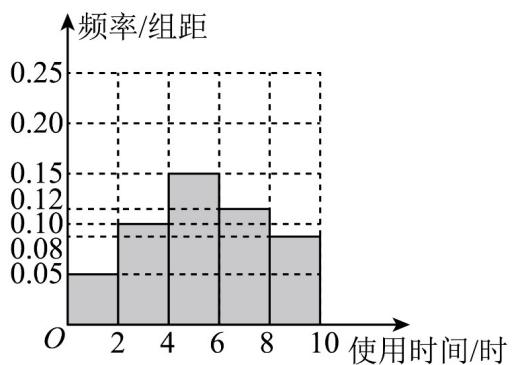

> [!faq]- 《专题9.1 随机抽样（高效培优讲义）数学人教A版高一必修第二册》官方解析
>
> > [!success]- **【答案】** $(1)^{40}$ ; $(2)^{4}$ , 1.
>
> > [!note]- **【分析】**
> > （ $^{1}$ ）根据题中数据，完成频率分布表，可完成频率分布直方图，设中位数为 x，则
> >
> > $(0.05+0.10)\times2+0.15\times(x-4)=0.5$ ，可得中位数；
> >
> > (2) 分别求出从 $^{6}$ 人中随机抽取 $^{2}$ 人总的事件数及 $^{2}$ 人取自不同使用时间区间的事件数，由古典概型公式可
> >
> > ## 得概率·
>
> > [!note]- **【解析】**
> > 解：（1）根据题意，可将数据做如下整理：
> >
> > <table><tr><td>使用时间/时</td><td>(0,2]</td><td>(2,4]</td><td>(4,6]</td><td>(6,8]</td><td>(8,10]</td></tr><tr><td>大学生/人</td><td>5</td><td>10</td><td>15</td><td>12</td><td>8</td></tr><tr><td>频率</td><td>0.1</td><td>0.2</td><td>0.3</td><td>0.24</td><td>0.16</td></tr><tr><td>频率/组距</td><td>0.05</td><td>0.1</td><td>0.15</td><td>0.12</td><td>0.08</td></tr></table>
> >
> > 设中位数为 $x$ ，则 $(0.05 + 0.10)\times 2 + 0.15\times (x - 4) = 0.5$ ，解得 $x = 5.33\cdot$
> >
> > ∴大学生每天使用手机时间的中位数约为 5.33 小时·
> >
> > 
> >
> > (2) 用分层抽样的方法从使用时间在区间 $\left(0,2\right]$ , $\left(2,4\right]$ , $\left(4,6\right]$ 中抽取的人数分别为 $1,2,3$ ，分别设为 $a$ ， $b_{1}$ ， $b_{2}$ ， $c_{1}$ ， $c_{2}$ ， $c_{3}$ ，所有的基本事件为 $ab_{1}$ ， $ab_{2}$ ， $ac_{1}$ ， $ac_{2}$ ， $ac_{3}$ ， $b_{1}b_{2}$ ， $b_{1}c_{1}$ ， $b_{1}c_{2}$ ， $b_{1}c_{3}$ ， $b_{2}c_{1}$ ， $b_{2}c_{2}$ ， $b_{2}c_{3}$ ， $c_{1}c_{2}$ ， $c_{1}c_{3}$ ， $c_{2}c_{3}$ ，这 $^{2}$ 名大学生取自同一时间区间的基本事件， $b_{1}b_{2}$ ， $c_{1}c_{2}$ ， $c_{1}c_{3}$ ， $c_{2}c_{3}$ ，设这 $^{2}$ 名大学生取自不同使用时间区间为事件 A，符合条件的总事件数为 $^{15}$ ，在同一区间内的情形有 $^{4}$ 种情况，∴
> >
> > $$
> > P (A) = 1 - \frac {4}{1 5} = \frac {1 1}{1 5},
> > $$
> >
> > 故这 $^{2}$ 名年轻人取自不同使用时间区间的概率为 $\frac{11}{15}$
> >
> > 10. 你可能想了解全校同学生活、学习中的一些情况，例如，全校同学比较喜欢哪门课程，每月的零花钱平
> >
> > 均是多少，喜欢看《新闻联播》的同学的比例是多少，每天大约什么时间起床，每天睡眠的平均时间是多少，
> >
> > 等，选一些自己关心的问题，设计一份调查问卷，利用简单随机抽样方法调查你们学校同学的情况，并解释
> >
> > 你所得到的结论·
> >
> > 【答案】见解析
> >
> > 【解析】设计调查问卷，利用学号进行随机抽样，进行问卷调查，分析得到答案
> >
> > 【详解】如下设计调查问卷：
> >
> > (1) 你最喜欢哪一门课程？
> >
> > (2) 你每月的零花钱平均是多少？
> >
> > (3) 你喜欢看《新闻联播》吗？
> >
> > (4) 你每天早上几点起床？
> >
> > (5) 你每天晚上几点睡觉？
> >
> > 从学号中利用随机表随机选择 $^{100}$ 个同学，再进行问卷调查，回收问卷进行统计分析·
> >
> > 结论：高年级的学生平均睡眠时间少
> >
> > 原因：学习任务更紧张，学习时间更长
