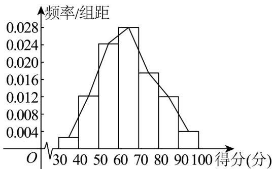

> [!faq]- 《专题9.1 随机抽样（高效培优讲义）数学人教A版高一必修第二册》官方解析
>
> > [!success]- **【答案】** $^{(1)}$ 最低分是32分，最高分是97分 (2) 答案见解析
>
> > [!note]- **【分析】**
> > （1）根据题目所给数据求得最高分和最低分·
> >
> > (2) 根据题目所给数据列出频率分布表，进而画出频率分布直方图和频率分布折线图.
>
> > [!note]- **【解析】**
> > （1）这次测试成绩的最低分是 $^{32}$ 分，最高分是 $^{97}$ 分。
> >
> > (2) 根据题意，列出样本的频率分布表如下：
> >
> > <table><tr><td>分组</td><td>频数</td><td>频率</td></tr><tr><td>[30,40)</td><td>1</td><td>0.02</td></tr><tr><td>[40,50)</td><td>6</td><td>0.12</td></tr><tr><td>[50,60)</td><td>12</td><td>0.24</td></tr><tr><td>[60,70)</td><td>14</td><td>0.28</td></tr><tr><td>[70,80)</td><td>9</td><td>0.18</td></tr><tr><td>[80,90)</td><td>6</td><td>0.12</td></tr><tr><td>[90,100]</td><td>2</td><td>0.04</td></tr><tr><td>合计</td><td>50</td><td>1.00</td></tr></table>
> >
> > 频率分布直方图和频率分布折线图如图所示.
> >
> > 
