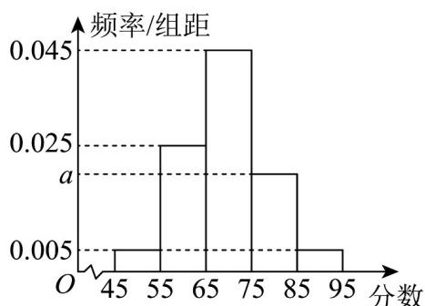
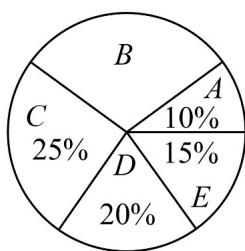
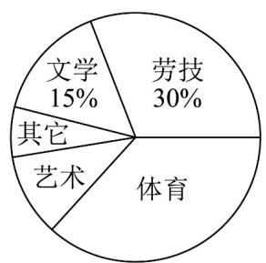
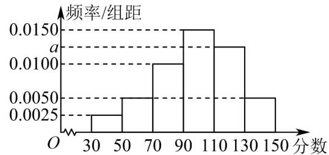

<!-- source-part:1 pages:1-50 -->

专题9.2 用样本估计总体

教学目标、教学重难点

<table><tr><td>教学目标</td><td>1.掌握样本频率分布表、频率分布直方图的制作步骤,能从图表中提取众数、中位数、平均数等关键信息2.理解样本数字特征(众数、中位数、平均数、方差、标准差)的定义,会精准计算,明确各特征的统计意义3.掌握用样本数字特征估计总体数字特征的核心方法,知晓样本代表性对估计准确性的影响4.能结合频率分布直方图估算中位数、平均数,区分图表估算与直接计算的差异,会用方差、标准差分析数据离散程度</td></tr><tr><td>教学重难点</td><td>1.重点样本众数、中位数、平均数、方差、标准差的定义+精准计算,明确各特征的核心作用(集中趋势/离散程度)2.难点方差、标准差的计算逻辑与意义理解(公式记忆难、易算错,难区分“数据波动大”与“估计误差大”)</td></tr></table>

## 知识清单

## 知识点 01 频率分布直方图

1、频率分布直方图绘制步骤

(1) 求极差，即一组数据中的最大值与最小值的差.

(2) 决定组距与组数．组距与组数的确定没有固定的标准，一般数据的个数越多，所分组数越多．当样本容

量不超过100时，常分成5\~12组．为方便起见，一般取等长组距，并且组距应力求“取整”.

(3) 将数据分组.

第 $i$ 组频数

（4）列频率分布表．计算各小组的频率，第 $i$ 组的频率是样本容量

(5) 画频率分布直方图. 其中横轴表示分组, 纵轴表示组距, 组距实际上就是频率分布直方图中各小长方

形的高度，它反映了各组样本观测数据的疏密程度。

2、频率分布直方图意义：各个小长方形的面积表示相应各组的频率，频率分布直方图以面积的形式反映数据

落在各个小组的频率的大小，各小长方形的面积的总和等于1.

3、总体取值规律的估计：我们可以用样本观测数据的频率分布估计总体的取值规律。

4、频率分布直方图的特征：当频率分布直方图的组数少、组距大时，容易从中看出数据整体的分布特点，但

由于无法看出每组内的数据分布情况，损失了较多的原式数据信息；当频率分布直方图的组数多、组距小时，

保留了较多的原始数据信息，但由于小长方形较多，有时图形会变得非常不规则，不容易从中看出总体数据

的分布特点.

## 【即学即练】

1. 某高校承办了地铁站的志愿者选拔面试工作，现随机抽取了 $200$ 名候选者的面试成绩（成绩均在[45,95]

内）并分成五组：第一组 $[45,55)$ ，第二组 $[55,65)$ ，第三组 $[65,75)$ ，第四组 $[75,85)$ ，第五组 $[85,95]$ ，绘制成

如图所示的频率分布直方图·

(1)求 $a$ 的值，并估计这 $^{200}$ 名候选者面试成绩的平均数（同一组中的数据用该组区间的中点值为代表）；

(2)现从第四组和第五组中用分层随机抽样的方法选取 $^{20}$ 人的成绩，若这 $^{20}$ 人中来自第四组候选者的测试成

绩的平均数和方差分别为 $^{80}$ 和 $^{6.5}$ ，来自第五组候选者的测试成绩的平均数和方差分别为 $^{90}$ 和 $^{3.5}$ ，据此估

计这次第四组和第五组所有参与测试的候选者的成绩的方差·

【答案】(1) a = 0.020，平均数为 69.5；

(2)21.9.

【分析】（1）利用频率分布直方图的性质求出 $a$ 值，再根据平均数的计算公式计算平均数

(2) 求出总平均数，根据方差公式计算总体方差·

【详解】（1）由题意知 $\left(0.005 + 0.025 + 0.045 + a + 0.005\right) \times 10 = 1$ ，解得 $a = 0.020$ .

估计这 $^{200}$ 名候选者面试成绩的平均数 $\overline{x}=50\times0.05+60\times0.25+70\times0.45+80\times0.2+90\times0.05=69.5$ ，即估计

这 200 名候选者面试成绩的平均数为 69.5.

(2) 设第四组、第五组测试候选者成绩的平均数和方差分别为 $\overline{x_4}$ , $\overline{x_5}$ , $s_4^2$ , $s_5^2$ ,

$$
\text {则} \overline {{x _ {4}}} = 8 0, \overline {{x _ {5}}} = 9 0, s _ {4} ^ {2} = 6. 5, s _ {5} ^ {2} = 3. 5
$$

且这两组的频率之比为 $4:1$ ，则这两组的平均数 $\overline{x_0} = \frac{80\times 4 + 90\times 1}{5} = 82$

所以第四组和第五组所有参与测试的候选者的测试成绩的方差

$$
s ^ {2} = \frac {4}{5} \left[ s _ {4} ^ {2} + \left(\overline {{{x _ {4}}}} - \overline {{{x _ {0}}}}\right) ^ {2} \right] + \frac {1}{5} \left[ s _ {5} ^ {2} + \left(\overline {{{x _ {5}}}} - \overline {{{x _ {0}}}}\right) ^ {2} \right] = \frac {4}{5} \times \left[ 6. 5 + (8 0 - 8 2) ^ {2} \right] + \frac {1}{5} \times \left[ 3. 5 + (9 0 - 8 2) ^ {2} \right] = 2 1. 9.
$$

所以第四组和第五组所有参与测试的候选者的成绩的方差为 21.9.

2. 从某小学随机抽取 $100$ 名同学，将他们的身高（单位：厘米）数据绘制成频率分布直方图（如图）。由图

中数据可知 $a =$ （结果保留3位小数）．若要从身高在 $[120,130)$ ， $[130,140)$ ， $[140,150]$ 三组的学生中，

用分层随机抽样的方法选取 $^{18}$ 人参加一项活动，则从身高在 $^{[140,150]}$ 的学生中选取的人数应为\_\_\_\_。

【答案】 0.030 3

【分析】由频率分布直方图面积可得 a，由三组之比为 3:2:1 可求解第二空.

【详解】由 $10(0.005 + a + 0.035 + 0.020 + 0.010) = 1$

解得 a = 0.030

$\left[120,130\right)$ 的频率为 $0.3$ ， $\left[130,140\right)$ 的频率为 $0.2$ ， $\left[140,150\right]$ 的频率为 $0.1$

三组之比为 3:2:1，

所以用分层随机抽样的方法选取 $^{18}$ 人参加一项活动，则从身高在 $^{[140,150]}$ 的学生中选取的人数应为 $18\times\frac{1}{6}=3$

故答案为：0.030，3

## 知识点 02 其他统计图

1、常见的其他统计图：条形图、扇形图、折线图。

扇形图主要用于直观描述各类数据占总数的比例；

条形图和直方图主要用于直观描述不同类别或分组数据的频数和频率；

折线图主要用于描述数据随时间的变化趋势.

2、各个统计图特点

（1）不同的统计图在表示数据上有不同的特点．如扇形图主要用于直观描述各类数据占总数的比例，条形图和直方图主要用于直观描述不同类别或分组数据的频数和频率，折线图主要用于描述数据随时间的变化趋势．(2）不同的统计图适用的数据类型也不同．如条形图适用于描述离散型的数据，直方图适用于描述连续性数据．

## 【即学即练】

1. 某市教育局对全市高三年级的学生身高进行抽样调查，随机抽取了 $200$ 名学生，他们的身高都处在 $A, B, C, D, E$ 五个层次内，根据抽样结果得到统计图表，则样本中（）

【答案】

女生身高情况直方图 男生身高情况扇形图

A. 女生人数多于男生人数（）
B. D层次男生人数多于女生人数
C. B层次男生人数为 $^{24}$ 人
D. A层次人数最少

【答案】AC
【分析】根据表中数据依次讨论各选项即可求解·

【详解】对于 $^{A}$ 选项，由题可知，女生A层次的有 $^{18}$ 人，B层次的有 $^{48}$ 人，C层次的有 $^{30}$ 人，D层次的有

18 人，E 层次的有 6 人，故女生共有 $18 + 48 + 30 + 18 + 6 = 120$ 人，

男生有 200 - 120 = 80 人，所以女生人数多于男生人数，故 A 选项正确；

对于 $^{B}$ 选项，由扇形图知，男生D层次的有 $80\times20\%=16$ 人，而女生有 $^{18}$ 人，故女生多于男生，错误；

对于 C 选项，B 层次的有 $80 \times (1 - 20\% - 25\% - 15\% - 10\%) = 80 \times 30\% = 24$ 人，故正确；

对于 D 选项，A 层次的有 $18 + 80 \times 10\% = 26$ 人，E 层次的有 $6 + 80 \times 15\% = 18$ 人，故 A 层次的人数不是最少的。

故选：AC

2. 为深化义务教育课程改革，某校积极开展拓展性课程建设，计划开设艺术、体育、劳技、文学等多个类别

的拓展性课程，要求每一位学生都自主选择一个类别的拓展性课程．为了了解学生选择拓展性课程的情况，

随机抽取了部分学生进行调查，并将调查结果绘制成如下统计图（部分信息未给出）：

某校选择拓展课程的人数条形统计图 某校选择拓展课程的人数扇形统计图

根据统计图中的信息，解答下列问题：

(1)求本次被调查的学生人数.

(2)将条形统计图补充完整.

(3)若该校共有 1600 名学生，请估计全校选择体育类的学生人数。

【答案】(1)200

(2)答案见解析

(3)560

【分析】（1）结合题中给出的条形图和扇形图，选择劳技的人数和百分率都知道，即可求出被调查的学生人

数；

(2) 有了总体，由扇形图可知选择文学的百分率是 $15\%$ ，即可求出选择文学的人数，再用学生总人数减去

艺术、劳技、文学、其他的人数，得到选择体育的人数，并据此画完该条形图；

(3) 根据用样本估计总体的方法，先计算选择体育类的百分率，再乘以全校总人数即可·

【详解】（1）由条形图和扇形图，选择劳技的人数为 $60$ 人，百分率是 $30\%$ ，

则被调查学生的总人数为： $60 \div 30\% = 200$ （人）；

(2) 选择文学的百分率是 $15\%$ ，由 (1) 知被调查学生的总人数为 200 人；

则选择文学的学生人数为： $200 \times 15\% = 30$ （人），

选择体育的学生人数：200-24-60-30-16=70（人），

完成的条形图如下：

某校选择拓展课程的人数条形统计图

(3) 选择体育类的百分比为 200，

所以估计全校选择体育类的学生有 $1600 \times \frac{70}{200} = 560$ （人）.

## 知识点 03 第 p 百分位数

1、第 $p$ 百分位数的定义

一般地，一组数据的第 $p$ 百分位数是这样一个值，它使得这组数据中至少有 $p\%$ 的数据小于或等于这个值，

且至少有 $(100 - p)\%$ 的数据大于或等于这个值.

2、计算第 $p$ 百分位数的步骤

第1步：按从小到大排列原始数据.

第2步：计算 $i=n\times p\%$ .

第3步：若 $i$ 不是整数，而大于 $i$ 的比邻整数为 $j$ ，则第 $p$ 百分位数为第 $j$ 项数据；若 $i$ 是整数，则第 $p$ 百分位

数为第 $i$ 项与第 $(i + 1)$ 项数据的平均数.

【即学即练】

1. 为有助于形成节能减排的社会共识，促进资源节约型，环境友好型社会的建设，某市拟建立“多用者多付

费”的阶梯电价机制，要求约 $75\%$ 的居民用电量在第一阶梯内，约 $20\%$ 的居民用电量在第二阶梯内，约 $5\%$ 的

居民用电量在第三阶梯内·假设从该市抽取了 $200$ 户居民的用电量（单位： $\mathrm{kW} \cdot \mathrm{h}$ ）进行整理，并由此作出如

图所示的频率分布直方图·根据用样本估计总体的思想确定阶梯电价的临界点 $a, b$ ，并且每户的用电单价与每

户用电量的关系如下表所示·记户月用电量为 $x\mathrm{kW}\cdot \mathrm{h}$ 时应缴纳的电费为 $f(x)$ 元

<table><tr><td rowspan="4"></td><td>分档</td><td>户用电量(单位:kW·h)</td><td>用电单价(单位:元/kW·h)</td></tr><tr><td>第一阶梯</td><td>0~a(含a)</td><td>0.5</td></tr><tr><td>第二阶梯</td><td>a~b(含b)</td><td>0.55</td></tr><tr><td>第三阶梯</td><td>b~+∞</td><td>0.8</td></tr></table>

(1)求 $a$ ， $b$ 的值；

(2)写出 $f(x)$ 的解析式；

(3)小明家本月缴纳电费 $195$ 元，他家本月用电量是多少？

【答案】(1) $a = 200$ ， $b = 300$

$$
f (x) = \left\{ \begin{array}{l} 0. 5 x, 0 <   x \leq 2 0 0 \\ 0. 5 5 x - 1 0, 2 0 0 <   x \leq 3 0 0 \\ 0. 8 x - 8 5, x > 3 0 0 \end{array} \right. \tag {2}
$$

(3) $350 \, kW \cdot h$

【分析】（ $^{1}$ ）根据频率分布直方图求解百分位数即可得解，

(2) (3) 根据阶梯电费，即可根据分段函数的性质求解.

【详解】（1）由题 $a, b$ 分别为这组数据的 $75\%$ 分位数、 $95\%$ 分位数·

$0.75 = 0.0025 \times 100 + (a - 100) \times 0.005$ ，解得 $a = 200$ ，

$$
0. 9 5 = 0. 0 0 2 5 \times 1 0 0 + 0. 0 0 5 \times 1 0 0 + (b - 2 0 0) \times 0. 0 0 2 \text {, 解 得} b = 3 0 0
$$

(2) $f(x)$ 是一个分段函数，而且：当 $0 < x \leq 200$ 时，有 $f(x) = 0.5x$ ；

当 $200 < x \leq 300$ 时，有 $f(x) = 0.5 \times 200 + (x - 200) \times 0.55 = 0.55x - 10$ ；

当 $x > 300$ 时，有 $f(x) = 0.5 \times 200 + (300 - 200) \times 0.55 + (x - 300) \times 0.8 = 0.8x - 85$

$$
f (x) = \left\{ \begin{array}{l} 0. 5 x, 0 <   x \leq 2 0 0 \\ 0. 5 5 x - 1 0, 2 0 0 <   x \leq 3 0 0 \\ 0. 8 x - 8 5, x > 3 0 0 \end{array} . \right.
$$

(3) 若 $0 < x \leq 200$ ， $f(x) \leq 0.5 \times 200 = 100$ ；

若 $200 < x \leq 300$ ， $f(x) \leq 0.55 \times 300 - 10 = 155$

因为 $f(x)=195$ ，所以 x>300，0.8x-85=195 解得 x=350。

答：小明家本月用电量是 $350\mathrm{kW}\cdot \mathrm{h}$

2. 某市通过简单随机抽样，获得了 $1000$ 户居民用户的月均用电量数据，发现他们的用电量都在

$50\sim 350\mathrm{kW}\cdot \mathrm{h}$ 之间，进行适当分组后（每组为左闭右开的区间），画出频率分布直方图如图所示

(1)求直方图中 $x$ 的值；

(2)求在被调查的用户中，用电量落在区间 $\left[50,200\right)$ 内的用户数；

(3)该市政府计划对居民生活用电费用实施阶梯式电价制度，即确定一个居民月均用电量标准 $a$ ，用电量不超

过 $a$ 的部分按平价收费，超出 $a$ 的部分按议价收费·如果希望 $80\%$ 的居民生活用电费用支出不受影响，将 $a$ 定

为 $250kW \cdot h$ 是否合理？请说明理由·

【答案】(1) $x = 0.0044$

(2)600

(3)合理，理由见解析

【分析】（1）根据频率和为 $^{1}$ ，列式计算求出参数；

(2) 先计算频率再计算用户数；

(3) 应用频率分布直方图列式计算频率结合已知说明理由·

【详解】（1）根据频率和为 $^{1}$ ，可知

$\left(0.0024 + 0.0036 + 0.0060 + x + 0.0024 + 0.0012\right) \times 50 = 1$ ，计算得： $x = 0.0044$ ；

$$
(2) (0. 0 0 2 4 + 0. 0 0 3 6 + 0. 0 0 6 0) \times 5 0 \times 1 0 0 0 = 6 0 0;
$$

$$
(3) (0. 0 0 2 4 + 0. 0 0 3 6 + 0. 0 0 6 0 + 0. 0 0 4 4) \times 5 0 = 0. 8 2
$$

合理，样本的第 $^{80}$ 百分位数接近于 $^{250}$ ，由于样本的取值规律与总体的取值规律之间会存在偏差，

在实际决策中，只要临界值近似为第 $^{80}$ 百分位数即可，为了实际中操作方便，

可以建议市政府把月均用电量标准定为 $250 \, kW \cdot h$ .

## 知识点 04 众数、中位数、平均数

1、众数、中位数、平均数定义

(1) 众数：一组数据中重复出现次数最多的数。

(2) 中位数：把一组数据按从小到大的顺序排列，处在中间位置（或中间两个数的平均数）的数叫做这组数

据的中位数.

(3) 平均数：如果 $n$ 个数 $x_{1}, x_{2}, \ldots, x_{n}$ ，那么 $\overline{x} = \frac{1}{n} (x_{1} + x_{2} + \ldots + x_{n})$ 叫做这 $n$ 个数的平均数。

2、频率分布直方图中的众数、中位数、平均数

(1) 在频率分布直方图中，众数是最高矩形中点的横坐标；

(2) 中位数左边和右边的直方图的面积应该相等；

(3) 平均数的估计值等于频率分布直方图中每个小矩形的面积乘以小矩形底边中点的横坐标之和.

【即学即练】

1. 某校高二年级期中考试后，为了解本次考试的情况，在整个年级中随机抽取了 $200$ 名学生的数学成绩，将

成绩分为 $[30,50), [50,70), [70,90), [90,110), [110,130), [130,150]$ 共6组，得到如图所示的频率分布直方图。

(1)求实数 $a$ 的值；

(2)在样本中，采取按比例分层抽样的方法从成绩在 $[90,150]$ 的学生中抽取 $^{13}$ 人，问其中成绩在 $[130,150]$ 的学
生有几名？

(3)根据图中的样本数据，

①试估计本次考试的中位数；

②假设同组中每个数据用该组区间的中点值代替，估计本次考试的平均分.

(4)已知落在 $\left[70,90\right)$ 的平均成绩是 $76$ ，落在 $\left[90,110\right)$ 的平均成绩是 $91$ ，求两组成绩合并后的平均数 $\bar{z}$

【答案】(1) $a = 0.0125$

(2)2 ;

(3)① 100, ② 98;

(4)85.

【分析】（1）根据频率和为 $^{1}$ 求a的值；

(2) 根据分层抽样的方法求解；

(3) 利用频率分布直方图估计中位数和平均数即可；

(4) 利用平均数公式求解·

【详解】（1）由频率分布直方图知 $(0.0025 + 0.0050 \times 2 + 0.0100 + a + 0.0150) \times 20 = 1$ ，解得 $a = 0.0125$ .

(2) 其中成绩在 $\left[130,150\right]$ 的学生有 $\frac{0.0050}{0.0150+0.0125+0.0050}\times13=2$ 人；

(3) ①因为 $(0.0025 + 0.0050 + 0.0100) \times 20 = 0.35$ ，所以中位数位于[90,110)，

设中位数为 x，则 $(x-90)\times0.0150=0.5-0.35$ ，解得 x=100，

所以本次考试的中位数为100；

本次考试的平均分为 $(40\times 0.0025 + 60\times 0.0050 + 80\times 0.0100 + 100\times 0.0150 + 120\times 0.0125 + 140\times 0.0050)\times 20 = 98$ （4） $\frac{-}{z} = \frac{0.01\times 76 + 0.015\times 91}{0.01 + 0.015} = \frac{2.125}{0.025} = 85.$

2．有甲、乙、丙三个班，甲班有 $m$ 个人，乙班有 $n$ 个人，丙班有 $k$ 人（以上所有参数均为正整数），在一次考

试中甲班平均分是 $a$ 分，乙班平均分是 $b$ 分，丙班平均分是 $t$ 分．则甲、乙、丙三个班在这次考试中的总平均分

是（ ）A. $\frac{a + b + t}{2}$ B. $\frac{m + n + k}{2}$ C. $\frac{am + bn + kt}{a + b + t}$ D. $\frac{am + bn + kt}{m + n + k}$

【答案】D

【分析】先求出甲乙丙三班的总分，再运用求平均数的计算公式进行计算即可.

【详解】甲班有 m 个人，乙班有 n 个人，丙班有 k 人，甲班平均分是 a 分，乙班平均分是 b 分，丙班平均分是 t 分，

∴ $(am + bn + kt)$ 甲乙丙三班在这次考试中的总分为：分，

$$
a m + b n + k t
$$

∴甲乙丙三班在这次考试中的总平均分是 $m+n+k$ 分·

故选：D.

## 知识点 05 方差、标准差

## 1、方差、标准差的定义

一组数据 $x_{1}, x_{2}, \ldots, x_{n}$ ，用 $\overline{x}$ 表示这组数据的平均数，则这组数据的方差为 $\frac{1}{n} \sum_{i=1}^{n} (x_{i} - \overline{x})^{2} = \frac{1}{n} \sum_{i=1}^{n} x_{i}^{2} - \overline{x}$ ，标准差为 $\sqrt{\frac{1}{n} \sum_{i=1}^{n} (x_{i} - \overline{x})^{2}}$ 。

## 2、总体方差、总体标准差的定义

如果总体中所有个体的变量值分别为 $Y_{1}, Y_{2}, \ldots, Y_{N}$ ，总体平均数为 $\overline{Y}$ ，则称 $S^{2} = \frac{1}{N} \sum_{i=1}^{N} \left(Y_{i} - \overline{Y}\right)^{2}$ 为总体方差， $S = \sqrt{S^{2}}$ 为总体标准差。如果总体的 $N$ 个变量值中，不同的值共有 $k (k \leq N)$ 个，记为 $Y_{1}, Y_{2}, \ldots, Y_{k}$ ，其中 $Y_{i}$ 出现的频数为 $f_{i}(i = 1,2,\dots ,k)$ ，则总体方差为 $S^2 = \frac{1}{N}\sum_{i = 1}^{k}f_i\left(Y_i - \overline{\mathbf{Y}}\right)^2$

3、样本方差、样本标准差的定义

如果一个样本中个体的变量值分别为 $y_{1}, y_{2}, \ldots, y_{n}$ ，样本平均数为 $\overline{y}$ ，则称 $s^{2} = \frac{1}{n} \sum_{i=1}^{n} (y_{i} - \overline{y})^{2}$ 为样本方差， $s = \sqrt{s^{2}}$ 为样本标准差。

## 4、方差、标准差特征

标准差、方差刻画了数据的离散程度或波动幅度，标准差越大，数据的离散程度越大；标准差越小，数据的

离散程度越小．在刻画数据的分散程度上，方差和标准差是一样的．但在解决实际问题中，一般多采用标准

差.

## 【即学即练】

1. 某学校高一年级某班男同学与女同学的人数之比为 $5:4$ ，在学校的一次月考中，某数学教师为分析本班的

成绩，作了如下统计：

女同学成绩频数分布表

<table><tr><td>成绩值区间</td><td>[95,105)</td><td>[105,115)</td><td>[115,125)</td><td>[125,135)</td><td>[135,145]</td><td>合计</td></tr><tr><td>频数</td><td>3</td><td>4</td><td>10</td><td>2</td><td>1</td><td>20</td></tr></table>

男同学成绩频率分布直方图

(1)估计本班女同学成绩的平均数 $\overline{x}$ （同一组中的数据用该组区间的中点值作代表）；

(2)根据男同学成绩的频率分布直方图，比较男同学成绩的平均数与中位数的大小；

(3)已知女同学成绩的方差为 $169$ ，男同学成绩的方差为 $104$ ，估计该班全体同学成绩的方差（平均用四舍五

入取整数计算，方差结果取整数）·

参考公式：总体划分为女生和男生 $^{2}$ 层，通过分层随机抽样，各层抽取的样本量、样本平均数和样本方差分

别为 $m$ ， $\overline{x}$ ， $s_1^2$ ； $n$ ， $\overline{y}$ ， $s_2^2$ ，记总的样本平均数和样本方差分别为 $\overline{\omega}$ ， $s^2$ ，则

$$
s ^ {2} = \frac {m}{m + n} \left[ s _ {1} ^ {2} + (\bar {x} - \bar {\omega}) ^ {2} \right] + \frac {n}{m + n} \left[ s _ {2} ^ {2} + (\bar {y} - \bar {\omega}) ^ {2} \right].
$$

【答案】(1)117

(2)平均数小于中位数

(3)135

【分析】（1）利用频率分布表的性质求解平均数即可·

(2) 利用频率分布直方图的性质求解平均数和中位数，再比较大小即可·

(3) 先求出样本平均数，再结合样本方差公式求解方差即可·

【详解】（ $^{1}$ ）由题意得

$$
\overline {{x}} = \frac {1 0 0 \times 3 + 1 1 0 \times 4 + 1 2 0 \times 1 0 + 1 3 0 \times 2 + 1 4 0 \times 1}{2 0}
$$

$$
= \frac {3 0 0 + 4 4 0 + 1 2 0 0 + 2 6 0 + 1 4 0}{2 0} = \frac {2 3 4 0}{2 0} = 1 1 7.
$$

(2) 因为小长方形面积和为 1，

所以 $10 \times (0.012 + a + 0.056 + 0.016 + a) = 1$ ，解得 $a = 0.008$

设平均数为 $\overline{y}$ ，中位数为 v，

由题意得 $\overline{y}=100\times0.012\times10+110\times0.008\times10$

$$
+ 1 2 0 \times 0. 0 5 6 \times 1 0 + 1 3 0 \times 0. 0 1 6 \times 1 0 + 1 4 0 \times 0. 0 0 8 \times 1 0 = 1 2 + 8. 8 + 6 7. 2 + 2 0. 8 + 1 1. 2 = 1 2 0
$$

因为 $0.012 \times 10 + 0.008 \times 10 + 0.056 \times 10 > 0.5$ ，所以中位数 $v$ 在 $[115, 125)$ 中，

由中位数性质得 $0.012 \times 10 + 0.008 \times 10 + 0.056 \times (v - 115) = 0.5$

$v=\frac{1685}{14}$ ，而 $\frac{1685}{14}-120=\frac{1685}{14}-\frac{1680}{14}=\frac{5}{14}>0$ ，可得中位数大于平均数。

(3) 因为男同学与女同学的人数之比为 $5:4$ ，且女生有 $20$ 人，所以男生有 $20 \times \frac{5}{4} = 25$ 人，

由题意得 $\overline{\omega}=\frac{20\times117+25\times120}{20+25}=\frac{356}{3}\approx119$

则样本方差为 $s^2 = \frac{20}{20 + 25}\left[169 + (117 - 119)^2\right] + \frac{25}{20 + 25}\left[104 + (120 - 119)^2\right]\approx 135.$

2．一组数据 $x_{1}$ ， $x_{2}$ ， $x_{3}$ ，L， $x_{n}$ 的平均值为5，方差为2，极差为7，中位数为6，记 $3x_{1}-1$ ， $3x_{2}-1$

$3x_{3} - 1$ ， $\mathbb{L}$ ， $3x_{n} - 1$ 的平均值为 $a$ ，方差为 $b$ ，极差为 $c$ ，中位数为 $d$ ，则（）A. $a = 14$ B. $b = 12$ C. $c = 21$ D. $d = 17$

【答案】ACD

【分析】根据平均值，方差，极差，中位数的定义及性质求解即可·

【详解】由题意可得 $a = 3 \times 5 - 1 = 14$ ， $b = 3^2 \times 2 = 18$ ， $c = 3 \times 7 = 21$ ， $d = 3 \times 6 - 1 = 17$ 。故选：ACD。

## 题型精讲

![[高中/课堂同步/题库/人教A版高中数学同步讲义(2026)/02_必修第二册/第九章 统计/专题9.2 用样本估计总体（高效培优讲义）数学人教A版高一必修第二册/题型01_频率分布直方图的绘制与应用/题型01_频率分布直方图的绘制与应用.md]]
![[高中/课堂同步/题库/人教A版高中数学同步讲义(2026)/02_必修第二册/第九章 统计/专题9.2 用样本估计总体（高效培优讲义）数学人教A版高一必修第二册/题型02_频率分布直方图中的相关计算问题/题型02_频率分布直方图中的相关计算问题.md]]
![[高中/课堂同步/题库/人教A版高中数学同步讲义(2026)/02_必修第二册/第九章 统计/专题9.2 用样本估计总体（高效培优讲义）数学人教A版高一必修第二册/题型03_对折线图_扇形图_条形图的识读/题型03_对折线图_扇形图_条形图的识读.md]]
![[高中/课堂同步/题库/人教A版高中数学同步讲义(2026)/02_必修第二册/第九章 统计/专题9.2 用样本估计总体（高效培优讲义）数学人教A版高一必修第二册/题型04_百分位数在具体数据中的应用/题型04_百分位数在具体数据中的应用.md]]
![[高中/课堂同步/题库/人教A版高中数学同步讲义(2026)/02_必修第二册/第九章 统计/专题9.2 用样本估计总体（高效培优讲义）数学人教A版高一必修第二册/题型05_平均数_中位数_众数在具体数据中的应用/题型05_平均数_中位数_众数在具体数据中的应用.md]]
![[高中/课堂同步/题库/人教A版高中数学同步讲义(2026)/02_必修第二册/第九章 统计/专题9.2 用样本估计总体（高效培优讲义）数学人教A版高一必修第二册/题型06_标准差与方差的应用/题型06_标准差与方差的应用.md]]
![[高中/课堂同步/题库/人教A版高中数学同步讲义(2026)/02_必修第二册/第九章 统计/专题9.2 用样本估计总体（高效培优讲义）数学人教A版高一必修第二册/强化训练/强化训练.md]]
