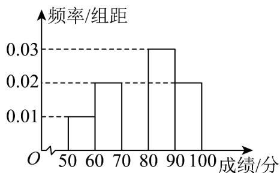

<!-- question-source:start -->
7. 某校组织 $^{50}$ 名学生参加庆祝中华人民共和国成立 $^{75}$ 周年知识竞赛，经统计这 $^{50}$ 名学生的成绩都在区间 $[50,100]$ 内，按分数分成 $^{5}$ 组： $[50,60)$ ， $[60,70)$ ， $[70,80)$ ， $[80,90)$ ， $[90,100]$ ，得到如图所示的频率分布

直方图（不完整），根据图中数据，下列结论正确的是（）

A. 成绩在 $[80,90)$ 上的人数最多 B. 成绩不低于 $70$ 分的学生所占比例为 $70\%$ C. $50$ 名学生成绩的平均分小于中位数 D. $50$ 名学生成绩的极差为 $50$
<!-- question-source:end -->

![[高中/课堂同步/题库/人教A版高中数学同步讲义(2026)/02_必修第二册/第九章 统计/专题9.2 用样本估计总体（高效培优讲义）数学人教A版高一必修第二册/强化训练/questions/answers/Q00078107A1.md]]
