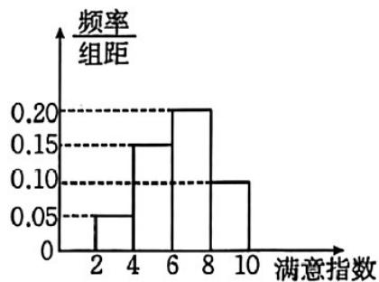
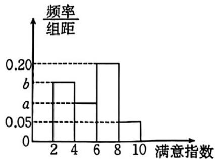

> [!faq]- 《专题9.2 用样本估计总体（高效培优讲义）数学人教A版高一必修第二册》官方解析
>
> > [!success]- **【答案】** ABC
>
> > [!note]- **【分析】**
> > 根据频率分布直方图求出 $\left[70,80\right)$ 的频率，A项可由各矩形高度可判断；B项由频率计算可判断；C
> > 项分别求出平均数、中位数比较可判断；D项由极差定义可判断·
>
> > [!note]- **【解析】**
> > 设 $\left[70,80\right)$ 组的频率为a，则由各组频率之和为1可得 $10\times(0.01+0.02+0.03+0.02)+a=0.8+a=1$ ，解得a=0.2； $[50,60)$ ， $[60,70)$ ， $[70,80)$ ， $[80,90)$ ， $[90,100]$ 各组频率依次为： $[50,60)$ ， $[60,70)$ ， $[70,80)$ ， $[80,90)$ ，
> >
> > 0.1, 0.2, 0.2, 0.3, 0.2
> >
> > 对于 A， $[80,90)$ 组频率最大，即成绩在 $[80,90)$ 上的人数最多，故 A 正确；
> >
> > 对于 $^{B}$ ，成绩低于 $^{70}$ 分的学生频率为 $0.1 + 0.2 = 0.3$ ，即不低于 $^{70}$ 分的学生频率为 $1 - 0.3 = 0.7$ ，
> >
> > 所以成绩不低于 $^{70}$ 分的学生所占比例为 $70\%$ ，故 $^{B}$ 正确；
> >
> > 对于 $C$ ，根据频率分布直方图，可得 $^{50}$ 名学生成绩的平均数是
> >
> > $$
> > 5 5 \times 0. 1 + 6 5 \times 0. 2 + 7 5 \times 0. 2 + 8 5 \times 0. 3 + 9 5 \times 0. 2 = 7 8
> > $$
> >
> > 由 $0.1 + 0.2 + 0.2 = 0.5$ ，故 50 名学生成绩的中位数为 80，
> >
> > 所以 $^{50}$ 名学生成绩的平均分小于中位数，故选项 $^{C}$ 正确；
> >
> > 对于 $^{D}$ ，极差为数据中最大值与最小值的差，已知 $^{50}$ 名学生的成绩都在区间 $\left\lfloor 50,100 \right\rfloor$ 内，但成绩的最大值
> >
> > 不一定是 $100$ ，最小值也不一定是 $50$ ，故极差小于等于 $50$ ，
> >
> > 但不一定等于 $^{50}$ ，故 $^{D}$ 错误·
> >
> > 故选：ABC.
> >
> > 8. 为了解学生对 $A, B$ 两家餐厅的满意度情况，现从在 $A, B$ 两家餐厅都用过餐的学生中随机抽取了50人，
> >
> > 每人分别对这两家餐厅的满意度进行打分（分数区间为 $[2,10]$ ），将其分数记为满意指数·根据打分结果按
> >
> > $[2,4), [4,6), [6,8), [8,10]$ 分组，得到如图所示的频率分布直方图，其中 $B$ 餐厅的满意指数在 $[2,4)$ 内的学生有
> >
> > 15 人.
> >
> > 
> >
> > 
> > A餐厅满意指数频率分布直方图
> > B餐厅满意指数频率分布直方图
> >
> > (1)求图中 $a, b$ 的值；
> >
> > (2)利用样本估计总体的思想，比较 $A$ ， $B$ 两家餐厅满意指数的平均数的大小；（计算平均数时同一组中的数
> >
> > 据用该组区间的中点值作代表）
> >
> > (3)若 $B$ 餐厅满意指数频率分布直方图中第三组满意指数的方差为 $2$ ，第四组满意指数的方差为 $1$ ，估计在 $B$
> >
> > 餐厅用过餐的第三组与第四组所有学生的满意指数的方差·（计算平均数时同一组中的数据用该组区间的中点
> >
> > 值作代表）
> >
> > 附：若数据 $x_{1}, x_{2}, \cdots, x_{m}$ 的平均数为 $\overline{x}$ ，方差为 $s_{1}^{2}$ ，数据 $y_{1}, y_{2}, \cdots, y_{n}$ 的平均数为 $\overline{y}$ ，方差为 $s_{2}^{2}$ ，将这两组数据混
> >
> > 合在一起得到一组新数据，设新数据的平均数为 $\overline{z}$ ，则新数据的方差
> >
> > $$
> > s ^ {2} = \frac {m}{m + n} \left[ s _ {1} ^ {2} + (\overline {{z}} - \overline {{x}}) ^ {2} \right] + \frac {n}{m + n} \left[ s _ {2} ^ {2} + (\overline {{z}} - \overline {{y}}) ^ {2} \right].
> > $$
> >
> > 【答案】(1) a = 0.10, b = 0.15;
> >
> > (2) A 餐厅满意指数的平均数大于 B 餐厅满意指数的平均数
> >
> > (3) $\frac{61}{25}$
> >
> > 【分析】（1）根据频率分布直方图的频率和为 $^{1}$ 的性质，结合已知参数值求解a,b；
> >
> > (2) 利用组中点值与对应频率的乘积和计算两个餐厅满意指数的平均数，并比较大小；
> >
> > (3) 先确定两组数据的人数，再根据混合数据的平均数和方差公式分步计算.
> >
> > 【详解】（1）B餐厅样本容量为50， $[2,4)$ 区间频数为15，对应频率为 $\frac{15}{50}=0.3$
> >
> > 频率分布直方图组距为 2，故 2b = 0.3, b = 0.15
> >
> > 所有区间频率和为 $2 \times (b + 0.20 + a + 0.05) = 1$ ，即 $a + b + 0.25 = 0.5$ ，解得 a = 0.1。
> >
> > (2) A 餐厅满意指数平均数 $\overline{x}_{A}=3\times0.1+5\times0.3+7\times0.4+9\times0.2=6.4$
> >
> > B 餐厅满意指数平均数 $\overline{x}_{B}=3\times0.3+5\times0.2+7\times0.4+9\times0.1=5.6$
> >
> > 故 $\overline{x}_{A} > \overline{x}_{B}$ .
> >
> > (3) B 餐厅第三组 $[6,8)$ 频率为 0.4，人数为 $50 \times 0.4 = 20$ ，平均数 7，方差 2；
> >
> > 第四组 $\left[8,10\right]$ 人数为 $50\times0.1=5$ ，平均数 $^{9}$ ，方差 $^{1}$ .
> >
> > 混合数据平均数 $\overline{z}=\frac{20\times7+5\times9}{20+5}=\frac{37}{5}$
> >
> > 方差 $s^2 = \frac{20}{25}\left[2 + \left(\frac{37}{5} - 7\right)^2\right] + \frac{5}{25}\left[1 + \left(\frac{37}{5} - 9\right)^2\right] = \frac{4}{5}\left(2 + \frac{4}{25}\right) + \frac{1}{5}\left(1 + \frac{64}{25}\right) = \frac{305}{125} = \frac{61}{25}.$
