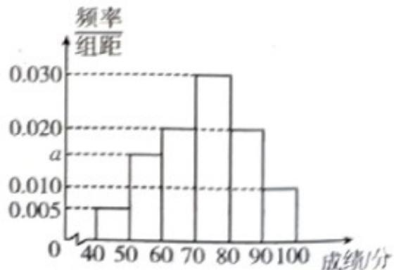

<!-- question-source:start -->
【变式1】某地区举办“机器人创新大赛”，现从参加该比赛的所有参赛者中随机抽取 $^{200}$ 名参赛者，将这 $^{200}$ 名参赛者的比赛成绩（单位：分）按 $\left[40,50\right)$ ， $\left[50,60\right)$ ， $\left[60,70\right)$ ， $\left[70,80\right)$ ， $\left[80,90\right)$ ， $\left[90,100\right]$ 分成6组，并

绘制成如图所示的频率分布直方图·

(1)求 $a$ 的值；

作代表）

(3)已知落在 $\left[60,70\right)$ 内比赛成绩的平均数为64.5，方差是14，落在 $\left[60,80\right)$ 内比赛成绩的平均数是70.5，落在 $\left[70,80\right)$ 内比赛成绩的方差是4，求落在 $\left[70,80\right)$ 内比赛成绩的平均数与落在 $\left[60,80\right)$ 内比赛成绩的方差·

附：若数据 $x_{1}, x_{2}, \cdots, x_{m}$ 的平均数为 $\overline{x}$ ，方差为 $s_{1}^{2}$ ，数据 $y_{1}, y_{2}, \cdots, y_{n}$ 的平均数为 $\overline{y}$ ，方差为 $s_{2}^{2}$ ，将这两组数据

混合在一起得到一组新数据，设新数据的平均数为 $z$ ，则新数据的方差

$$
s ^ {2} = \frac {m}{m + n} \left[ s _ {1} ^ {2} + (\bar {z} - \bar {x}) ^ {2} \right] + \frac {n}{m + n} \left[ s _ {2} ^ {2} + (\bar {z} - \bar {y}) ^ {2} \right].
$$
<!-- question-source:end -->

![[高中/课堂同步/题库/人教A版高中数学同步讲义(2026)/02_必修第二册/第九章 统计/专题9.2 用样本估计总体（高效培优讲义）数学人教A版高一必修第二册/题型01_频率分布直方图的绘制与应用/questions/answers/Q00078080A1.md]]
