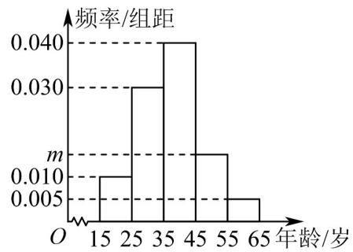

<!-- question-source:start -->
【变式2】中国 $\mathsf{Al}$ 大模型正处于一个技术进步迅速、市场规模快速增长的爆发式发展阶段．为了了解中国 $\mathsf{Al}$

大模型用户的年龄分布，A公司调查了500名中国AI大模型用户，统计他们的年龄（都在[15,65]内），按照

$[15,25)$ ， $[25,35)$ ， $[35,45)$ ， $[45,55)$ ， $[55,65]$ 进行分组，得到如图所示的频率分布直方图.

(1)求 $m$ 的值；

(2)求这 $^{500}$ 名中国AI大模型用户的年龄在 $^{[35,65]}$ 内的人数；

(3)估计这 500 名中国 AI 大模型用户年龄的平均数（各组数据以该组区间的中点值作代表）.
<!-- question-source:end -->

![[高中/课堂同步/题库/人教A版高中数学同步讲义(2026)/02_必修第二册/第九章 统计/专题9.2 用样本估计总体（高效培优讲义）数学人教A版高一必修第二册/题型01_频率分布直方图的绘制与应用/questions/answers/Q00078081A1.md]]
