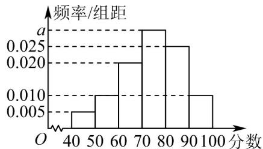

<!-- question-source:start -->
【典例1】文明城市是反映城市整体文明水平的综合性荣誉称号，作为普通市民，既是文明城市的最大受益

者，更是文明城市的主要创造者．某市为提高市民对文明城市创建的认识，举办了“创建文明城市”知识竞赛，

从所有答卷中随机抽取 $100$ 份作为样本，将样本的成绩（满分 $100$ 分，成绩均为不低于 $40$ 分的整数）分成六

段： $[40,50)$ ， $[50,60)$ ，…， $[90,100]$ 得到如图所示的频率分布直方图.

(1)求频率分布直方图中 $a$ 的值；

(2)求样本成绩的众数和平均数；

(3)若要从成绩在 $[60,70]$ , $[70,80]$ , $[80,90]$ 的三组数据中，用分层抽样的方法抽取15份成绩，则成绩在

$[80,90)$ 分的应抽取多少份？
<!-- question-source:end -->

![[高中/课堂同步/题库/人教A版高中数学同步讲义(2026)/02_必修第二册/第九章 统计/专题9.2 用样本估计总体（高效培优讲义）数学人教A版高一必修第二册/题型02_频率分布直方图中的相关计算问题/questions/answers/Q00078083A1.md]]
