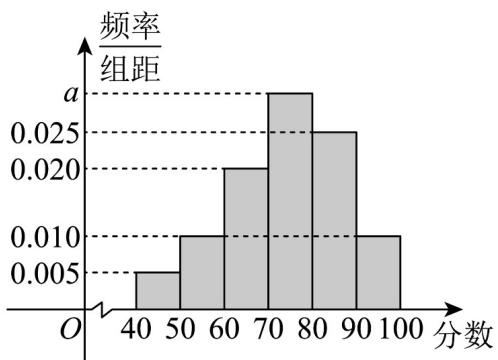

<!-- question-source:start -->
【变式2】文明城市是反映城市整体文明水平的综合性荣誉称号，作为普通市民，既是文明城市的最大受益者，更是文明城市的主要创造者。某市为提高市民对文明城市创建的认识，举办了“创建文明城市”知识竞赛，从所有答卷中随机抽取 $^{100}$ 份作为样本，将样本的成绩（满分 $^{100}$ 分，成绩均为不低于 $^{40}$ 分的整数）分成六段： $[40,50),[50,60),...,[90,100]$ 得到如图所示的频率分布直方图。

(1)求频率分布直方图中 a 的值及样本成绩的第 75 百分位数；

(2)求样本成绩的平均数；

(3)已知落在 $[50,60)$ 的平均成绩是 $54$ ，方差是 $7$ ，落在 $[60,70)$ 的平均成绩为 $66$ ，方差是 $4$ ，求两组成绩合并后的平均数 $\overline{z}$ 和方差 $s^2$ 。
<!-- question-source:end -->

![[高中/课堂同步/题库/人教A版高中数学同步讲义(2026)/02_必修第二册/第九章 统计/专题9.2 用样本估计总体（高效培优讲义）数学人教A版高一必修第二册/题型02_频率分布直方图中的相关计算问题/questions/answers/Q00078085A1.md]]
