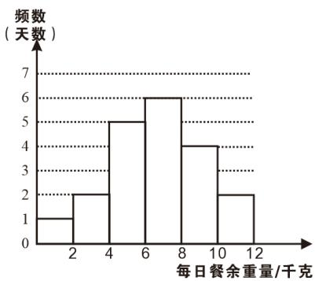

<!-- question-source:start -->
【变式3】郧阳中学倡导学生“文明用餐，减少浪费”，为了解午餐的浪费情况，对高一高二年级在工作日

（周一到周五）进行了连续四周的调查，得到这两个年级每天午餐浪费饭菜的重量，以下简称“每日餐余重

量”（单位：千克），并对这些数据进行了整理、描述和分析·下面给出了部分信息：

①高一年级每日餐余重量的频数分布直方图如图（数据分成 $^{6}$ 组：

$0 \leq x < 2, 2 \leq x < 4$ $4 \leq x < 6$ $6 \leq x < 8$ $8 \leq x < 10, 10 \leq x \leq 12$ ) :

②高一年级每日餐余重量在 $6 \leq x < 8$ 这一组的是：6.1 6.6 7.0 7.0 7.0 7.8

③高二年级每日餐余重量如下：

1.4 2.8 6.9 7.8 1.9 9.7 3.1 4.6 6.9 10.8

6.9 2.6 7.5 6.9 9.5 7.8 8.4 8.3 9.4 8.8

④两个年级这 $^{20}$ 天每日餐余重量的平均数、中位数、众数如表：

<table><tr><td>年级</td><td>平均数</td><td>中位数</td><td>众数</td></tr><tr><td>高一</td><td>6.4</td><td>m</td><td>7.0</td></tr><tr><td>高二</td><td>6.6</td><td>7.2</td><td>n</td></tr></table>

根据以上信息，回答下列问题：

(1)写出表 $m,n$ 中的值；

(2)结合上表，在两个年级中，“文明用餐，减少浪费”做得较好的年级是——；理由是——.

(3)结合我们学校高一高二年级每日餐余重量的样本数据，估计我们学校三个年级一年（按 $^{240}$ 个工作日计算，

假设每个年级人数相同）的餐余总重量。
<!-- question-source:end -->

![[高中/课堂同步/题库/人教A版高中数学同步讲义(2026)/02_必修第二册/第九章 统计/专题9.2 用样本估计总体（高效培优讲义）数学人教A版高一必修第二册/题型02_频率分布直方图中的相关计算问题/questions/answers/Q00078086A1.md]]
