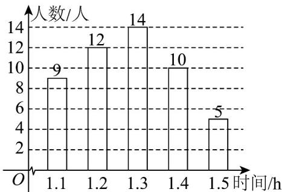

<!-- question-source:start -->
【典例1】为了解某校八年级学生每天做家庭作业的时间（单位：h），随机调查了该校八年级部分学生每天

做家庭作业的时间·根据统计的结果，绘制出如下的统计图①和图②·

图①

图②

请根据相关信息，解答下列问题：

(1)填空：图①中 m 的值为\_\_\_\_，统计的这部分学生每天做家庭作业时间的众数为\_\_\_\_，中位数为\_\_\_\_；

(2)求统计的这部分学生每天做家庭作业时间的平均数；

(3)根据样本数据，若该校八年级共有学生 $^{450}$ 人，估计该校八年级学生每天做家庭作业的时间超过 $^{1.2h}$ 的人

数约为多少？
<!-- question-source:end -->

![[高中/课堂同步/题库/人教A版高中数学同步讲义(2026)/02_必修第二册/第九章 统计/专题9.2 用样本估计总体（高效培优讲义）数学人教A版高一必修第二册/题型03_对折线图_扇形图_条形图的识读/questions/answers/Q00078087A1.md]]
